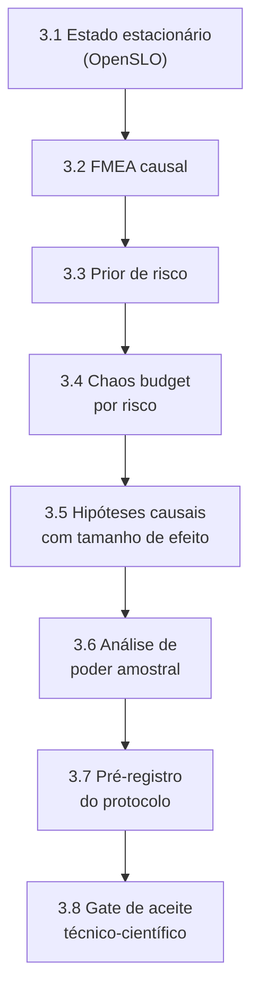

# HOWTO: Camada 1 (Planejamento Científico) do MECADE

Este guia descreve um roteiro E2E de implementação, testes e validação técnica da Camada 1, com foco em reprodutibilidade e auditabilidade.

## Sumário

- [Stack recomendada](#stack-recomendada)
- [1. O que torna esta Camada 1 inovadora](#1-o-que-torna-esta-camada-1-inovadora)
- [2. Entregas obrigatórias da Camada 1](#2-entregas-obrigatórias-da-camada-1)
- [3. Implementação passo a passo](#3-implementação-passo-a-passo)
- [4. Validação de fato da Camada 1](#4-validação-de-fato-da-camada-1)
- [5. Comandos úteis](#5-comandos-úteis)
- [6. Definição de pronto (Definition of Done)](#6-definição-de-pronto-definition-of-done)
- [7. Erros comuns a evitar](#7-erros-comuns-a-evitar)
- [8. Fechamento técnico](#8-fechamento-técnico)

## Stack recomendada

| Componente | Função na Camada 1 |
|---|---|
| OpenSLO | Especificação formal de objetivos (estado estacionário) |
| Prometheus | Medição operacional |
| Jupyter + Python | Análise estatística e poder amostral |
| LitmusChaos | Execução posterior, somente após o *gate* da Camada 1 |
| Git + DVC | Versionamento de protocolo e evidências |

## 1. O que torna esta Camada 1 inovadora

A inovação aqui não é "usar a ferramenta X", e sim transformar o planejamento em artefato científico:

1. Hipóteses causais explícitas, com tamanho de efeito esperado.
2. *Chaos budget* derivado de risco, e não de um número arbitrário.
3. Calibração inicial por *digital twin*/simulação antes de produção.
4. Protocolo pré-registrado de experimento (antes de executar).
5. Critério de decisão com confiança estatística e risco residual.

## 2. Entregas obrigatórias da Camada 1

Crie a estrutura de diretórios:

```bash
mkdir -p planning/layer1
mkdir -p planning/layer1/prereg
mkdir -p planning/layer1/evidence
```

Arquivos obrigatórios:

| Artefato | Caminho |
|---|---|
| Estado estacionário (OpenSLO) | `planning/layer1/steady-state.openslo.yaml` |
| FMEA causal | `planning/layer1/fmea-causal.csv` |
| Prior de risco | `planning/layer1/risk-prior.yaml` |
| Modelo de *chaos budget* | `planning/layer1/chaos-budget-model.yaml` |
| Hipóteses causais | `planning/layer1/hypotheses-causal.md` |
| Análise de poder amostral | `planning/layer1/power-analysis.md` |
| Protocolo pré-registrado | `planning/layer1/prereg/experiment-protocol.md` |
| Gate de aceite | `planning/layer1/acceptance-gate.yaml` |

Sem esses artefatos, o experimento não avança.

## 3. Implementação passo a passo



### 3.1 Definir estado estacionário formal (OpenSLO)

Exemplo mínimo:

```yaml
apiVersion: openslo/v1
kind: SLO
metadata:
  name: checkout-steady-state
spec:
  service: checkout
  indicators:
    - name: availability
      ratioMetric:
        counter: http_requests_total{service="checkout",status!~"5.."}
        total: http_requests_total{service="checkout"}
    - name: p99_latency
      thresholdMetric: histogram_quantile(0.99, sum(rate(http_request_duration_seconds_bucket{service="checkout"}[5m])) by (le))
  objectives:
    - displayName: availability_target
      target: 0.995
      timeWindow: 30d
    - displayName: p99_latency_target
      target: 0.300
      operator: lte
      unit: seconds
      timeWindow: 5m
```

Resultado esperado: baseline formal, mensurável e reproduzível.

### 3.2 FMEA causal (não apenas listagem)

Exemplo em `planning/layer1/fmea-causal.csv`:

```csv
failure_mode,cause,pathway,observable_effect,severity,occurrence,detection,rpn,owner
network_latency_800ms,mesh_delay_fault,checkout->payment->timeout,p99_up_and_tsr_down,9,6,4,216,platform
retry_storm,retry_policy_misconfig,checkout->retry_loop,error_rate_up_without_outage,8,5,6,240,sre
pod_kill_payment,node_pressure,payment->failover->recovery,short_unavailability,7,4,3,84,platform
```

Diferencial: cada linha inclui o *pathway* causal (causa → propagação → efeito observado).

### 3.3 Definir prior de risco (Bayes simples)

Exemplo em `planning/layer1/risk-prior.yaml`:

```yaml
risk_prior:
  financial:
    p_critical_failure: 0.12
    impact_weight: 0.9
  aerospace:
    p_critical_failure: 0.08
    impact_weight: 1.0
  infrastructure:
    p_critical_failure: 0.15
    impact_weight: 0.85
```

Uso: o *budget* e os limiares de aceitação devem ser mais conservadores para domínios com maior impacto ponderado.

### 3.4 Modelar Chaos Budget por risco

Exemplo em `planning/layer1/chaos-budget-model.yaml`:

```yaml
service: checkout
window: 15m
risk_aware_budget:
  formula: "B = B0 * (1 - impact_weight * p_critical_failure)"
  B0: 15.0
  selected_domain: financial
constraints:
  max_error_rate_delta: 0.015
  max_p99_latency_seconds: 0.450
  max_unavailable_seconds: 60
integral_limit:
  max_accumulated_deviation: 12.0
```

Diferencial: o *budget* é justificado por um modelo de risco explícito.

### 3.5 Escrever hipóteses causais com tamanho de efeito

Exemplo em `planning/layer1/hypotheses-causal.md`:

```markdown
# H1 - Efeito esperado do mecanismo de bloqueio

Intervenção: ativar o controle ALERT/LIMIT/BLOCK durante falha de latência progressiva.

Hipótese causal:
- O controle reduz o MTTR em pelo menos 15% em relação ao baseline reativo.

Métrica primária:
- MTTR (s)

Métricas secundárias:
- p99 latency, error_rate, TSR

Critério de sucesso:
- delta_MTTR <= -15% com IC 95% excluindo zero.
```

### 3.6 Fazer análise de poder amostral

Em `planning/layer1/power-analysis.md`, documente:

1. Efeito mínimo detectável (ex.: 15% em MTTR).
2. Poder estatístico alvo (>= 0.8).
3. Nível de significância (alpha = 0.05).
4. Número mínimo de repetições por cenário.

Sem poder amostral, o resultado é uma demonstração, não uma evidência.

### 3.7 Pré-registrar o protocolo

Exemplo em `planning/layer1/prereg/experiment-protocol.md`:

```markdown
# Pré-registro do experimento

- Pergunta de pesquisa
- Hipóteses H1..Hn
- Métricas primária/secundárias
- Cenários de falha
- Número de repetições
- Regras de exclusão de execução inválida
- Método estatístico
- Critério de aceite/rejeição
```

Pré-registro reduz viés de confirmação e fortalece a defesa acadêmica.

### 3.8 Definir gate de aceite técnico-científico

Exemplo em `planning/layer1/acceptance-gate.yaml`:

```yaml
must_have:
  - steady_state_formalized
  - fmea_causal_complete
  - risk_prior_defined
  - chaos_budget_risk_aware
  - hypotheses_with_effect_size
  - power_analysis_documented
  - preregistration_done
hard_fail_if:
  - missing_any_must_have
  - no_primary_metric
  - no_statistical_decision_rule
  - no_rollback_plan
```

## 4. Validação de fato da Camada 1

A Camada 1 está validada quando o planejamento permite inferência causal mínima, não apenas checklist operacional.

| # | Critério go/no-go | Condição de aprovação |
|---|---|---|
| 1 | Constructo válido | Cada hipótese possui intervenção, mecanismo esperado e métrica primária |
| 2 | Rigor estatístico | Existe poder amostral e regra de decisão pré-definida |
| 3 | Risco explicitado | O *chaos budget* foi derivado por prior de risco e domínio |
| 4 | Reprodutibilidade | O protocolo está pré-registrado e versionado |
| 5 | Auditabilidade | As decisões de planejamento deixam trilha de evidência |

Se os 5 itens passarem, a Camada 1 está validada para execução.

## 5. Comandos úteis

```bash
# validar sintaxe dos artefatos YAML
yq e '.' planning/layer1/*.yaml > /dev/null

# registrar evidências de planejamento no DVC
dvc add planning/layer1/evidence/

# versionar protocolo pré-registrado
git add planning/layer1/prereg/experiment-protocol.md
```

## 6. Definição de pronto (Definition of Done)

Considere a Camada 1 `DONE` quando:

- Hipóteses causais com efeito mínimo detectável estão definidas.
- *Budget* e limiares têm justificativa de risco.
- O plano estatístico está documentado antes dos testes.
- O *gate* científico foi executado e aprovado.
- Há aprovação conjunta de SRE e orientação metodológica.

## 7. Erros comuns a evitar

| Erro | Consequência |
|---|---|
| Definir hipótese sem tamanho de efeito | Resultado não é testável estatisticamente |
| Usar *threshold* por conveniência, sem racional de risco | *Chaos budget* perde justificativa científica |
| Rodar experimento sem pré-registro | Abre espaço para viés de confirmação |
| Reportar apenas a média, sem intervalo de confiança | Conclusão não reflete incerteza real |
| Tratar PoC como validação robusta, sem análise de poder | Conclusões não são generalizáveis |

## 8. Fechamento técnico

Com esta abordagem, a Camada 1 deixa de ser um checklist e passa a ser a base técnica para a execução experimental com critério, evidência e decisão reprodutível.
