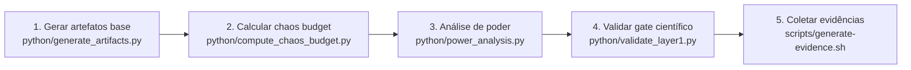

# MECADE Camada 1 - Implementação E2E

Este pacote implementa a Camada 1 (Planejamento Científico) do MECADE com artefatos obrigatórios, scripts de validação e *stack* Docker para Linux/macOS.

## Estrutura

| Caminho | Conteúdo |
|---|---|
| `planning/layer1/` | Artefatos obrigatórios da Camada 1 |
| `python/` | Scripts Python para geração, validação e análise |
| `scripts/` | Scripts shell de instalação e execução E2E |
| `docker/` | Configuração do Prometheus/Grafana |
| `docker-compose.yml` | *Stack* local para observabilidade e análise |

## Requisitos

- Linux ou macOS
- Python 3.10+
- Docker + Compose (`docker compose` ou `docker-compose`)

## Quickstart

```bash
cd MECADE_IMPLEMENTACAO_CAMADA01
bash scripts/install.sh
bash scripts/run-e2e.sh
# alternativa equivalente:
# bash scripts/run_e2e.sh
```

## Subir a stack Docker

```bash
bash scripts/docker-up.sh
```

## Smoke test da stack

Depois de subir os serviços, rode um único comando para validar os endpoints principais:

```bash
bash scripts/smoke-test.sh
```

| Serviço | Endpoint |
|---|---|
| Prometheus | `http://localhost:9090` |
| Grafana (admin/admin) | `http://localhost:3000` |
| Jupyter Lab (token `mecade`) | `http://localhost:8888/lab?token=mecade` |
| Pushgateway | `http://localhost:9091` |

## Derrubar a stack

```bash
bash scripts/docker-down.sh
```

## Fluxo E2E recomendado



| Etapa | Comando |
|---|---|
| 1. Gerar/atualizar artefatos base | `python python/generate_artifacts.py` |
| 2. Calcular *budget* por risco | `python python/compute_chaos_budget.py` |
| 3. Rodar análise de poder | `python python/power_analysis.py --baseline-mttr 120 --stddev 30 --effect-pct 0.15 --power 0.8 --alpha 0.05` |
| 4. Validar gate científico | `python python/validate_layer1.py` |
| 5. (Opcional) Coletar evidências | `bash scripts/generate-evidence.sh` |

## Observações

- Todos os arquivos obrigatórios da Camada 1 já vêm preenchidos para o cenário financeiro + microsserviços + Kubernetes.
- Ajuste nomes de serviço, SLIs, limiares e hipóteses para o seu contexto.
