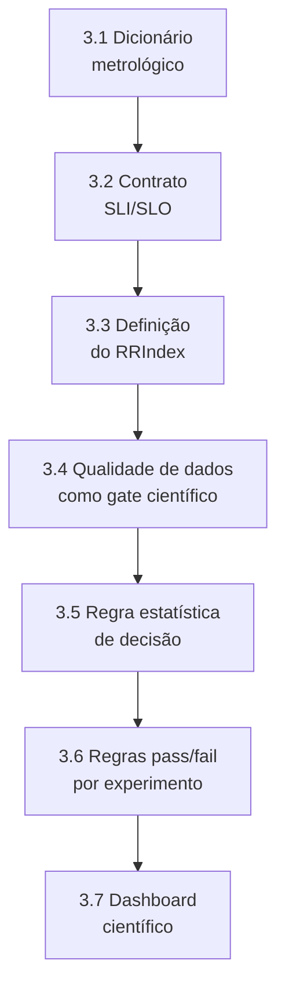

# HOWTO: Camada 2 (Metrologia Científica de Objetivos e Indicadores) do MECADE

Este guia é a referência E2E para implementar, testar e validar tecnicamente a Camada 2 com rigor metrológico e trilha de evidência.

## Sumário

- [Stack recomendada](#stack-recomendada)
- [1. O que torna esta Camada 2 inovadora](#1-o-que-torna-esta-camada-2-inovadora)
- [2. Entregas obrigatórias da Camada 2](#2-entregas-obrigatórias-da-camada-2)
- [3. Implementação passo a passo](#3-implementação-passo-a-passo)
- [4. Validação de fato da Camada 2](#4-validação-de-fato-da-camada-2)
- [5. Comandos úteis](#5-comandos-úteis)
- [6. Definição de pronto (Definition of Done)](#6-definição-de-pronto-definition-of-done)
- [7. Erros comuns a evitar](#7-erros-comuns-a-evitar)
- [8. Fechamento técnico](#8-fechamento-técnico)

## Stack recomendada

| Componente | Função na Camada 2 |
|---|---|
| OpenTelemetry | Instrumentação semântica |
| Prometheus + Thanos | Coleta, histórico e consulta |
| Grafana | Visualização e inspeção |
| OpenSLO / Sloth | SLO as Code |
| Great Expectations | Qualidade de dados de telemetria |
| Jupyter + Python | Inferência estatística e análise de incerteza |

## 1. O que torna esta Camada 2 inovadora

A inovação não é apenas medir P95/P99, e sim transformar telemetria em evidência científica:

1. Métricas com definição operacional e incerteza associada.
2. SLI/SLO com rastreabilidade matemática e semântica.
3. Contrato de qualidade de dados observacionais antes de decidir.
4. RRIndex metrológico como indicador agregado de maturidade.
5. Decisão *pass/fail* baseada em efeito e confiança, não apenas em *threshold* fixo.

## 2. Entregas obrigatórias da Camada 2

```bash
mkdir -p planning/layer2
mkdir -p planning/layer2/data-quality
mkdir -p planning/layer2/stats
mkdir -p observability/dashboards
```

Arquivos obrigatórios:

| Artefato | Caminho |
|---|---|
| Dicionário metrológico | `planning/layer2/metric-dictionary.yaml` |
| Contrato SLI/SLO | `planning/layer2/sli-slo-contract.yaml` |
| Definição do RRIndex | `planning/layer2/rrindex-definition.md` |
| Suíte de qualidade de dados | `planning/layer2/data-quality/gx-suite.yaml` |
| Regra de decisão estatística | `planning/layer2/stats/decision-rule.md` |
| Regras de validação | `planning/layer2/validation-rules.yaml` |
| Dashboard científico | `observability/dashboards/layer2-scientific-overview.json` |

Sem esses artefatos, a camada não atende ao rigor metrológico.

## 3. Implementação passo a passo



### 3.1 Definir dicionário metrológico de métricas

Exemplo em `planning/layer2/metric-dictionary.yaml`:

```yaml
service: checkout
metrics:
  - id: availability
    definition: "Proporcao de requisicoes bem-sucedidas"
    formula: "sum(rate(http_requests_total{service=\"checkout\",status!~\"5..\"}[5m])) / sum(rate(http_requests_total{service=\"checkout\"}[5m]))"
    unit: ratio
    expected_range: [0.0, 1.0]
    sampling_window: 5m
    uncertainty: "bootstrap_ci_95"

  - id: p99_latency_seconds
    definition: "Latencia no percentil 99"
    formula: "histogram_quantile(0.99, sum(rate(http_request_duration_seconds_bucket{service=\"checkout\"}[5m])) by (le))"
    unit: seconds
    expected_range: [0.0, 5.0]
    sampling_window: 5m
    uncertainty: "block_bootstrap_ci_95"
```

Diferencial: cada métrica tem unidade, faixa esperada e método de incerteza.

### 3.2 Formalizar contrato SLI/SLO

Exemplo em `planning/layer2/sli-slo-contract.yaml`:

```yaml
version: 1
service: checkout
objectives:
  - id: slo_availability_30d
    sli: availability
    target: 0.995
    window: 30d
    error_budget: 0.005

  - id: slo_p99_5m
    sli: p99_latency_seconds
    target_lte: 0.300
    window: 5m

traceability:
  business_goal:
    - continuidade_operacional
    - experiencia_usuario
```

Diferencial: conecta o SLO técnico a um objetivo de negócio e a um *error budget*.

### 3.3 Definir o RRIndex de forma reprodutível

Exemplo em `planning/layer2/rrindex-definition.md`:

```text
RRIndex = w1 * (1 - norm_mttr) + w2 * norm_availability + w3 * (1 - norm_p99) + w4 * norm_tsr

Restricoes:
- w1 + w2 + w3 + w4 = 1
- pesos definidos por dominio de risco
- normalizacao por baseline pre-registrado

Saida:
- RRIndex em [0,1], maior e melhor
```

Diferencial: índice agregado com fórmula e restrições explícitas.

### 3.4 Qualidade de dados como gate científico

Exemplo em `planning/layer2/data-quality/gx-suite.yaml`:

```yaml
expectations:
  - expect_column_values_to_not_be_null:
      column: timestamp
  - expect_column_values_to_be_between:
      column: availability
      min_value: 0
      max_value: 1
  - expect_column_values_to_be_between:
      column: p99_latency_seconds
      min_value: 0
      max_value: 5
  - expect_column_pair_values_A_to_be_greater_than_B:
      column_A: window_end
      column_B: window_start
```

Sem qualidade mínima, a inferência é invalidada.

### 3.5 Definir regra estatística de decisão

Exemplo em `planning/layer2/stats/decision-rule.md`:

```text
Hipotese de melhoria operacional:
- H0: delta_MTTR >= 0
- H1: delta_MTTR < 0

Criterio de aprovacao:
- IC95% de delta_MTTR totalmente abaixo de 0
- tamanho de efeito absoluto >= 10%
- nenhuma violacao critica simultanea de availability e p99
```

Diferencial: decisão baseada em evidência e efeito prático.

### 3.6 Regras pass/fail por experimento

Exemplo em `planning/layer2/validation-rules.yaml`:

```yaml
experiment: net-latency-800ms
window: 10m
primary_decision:
  metric: mttr_seconds
  require_ci95_below_zero_delta: true
  minimum_effect_percent: 10
safety_constraints:
  - metric: availability
    op: gte
    value: 0.995
  - metric: p99_latency_seconds
    op: lte
    value: 0.450
```

### 3.7 Dashboard científico

O dashboard da Camada 2 deve conter:

| Painel | Conteúdo |
|---|---|
| Série temporal | Métrica com banda de confiança |
| Valor pontual | Estimativa com intervalo de incerteza |
| Error budget | *Burn rate* do orçamento de erro |
| RRIndex | Evolução por ciclo |
| Qualidade de dados | Estado do contrato de qualidade |

## 4. Validação de fato da Camada 2

A Camada 2 está validada quando os indicadores são mediáveis, confiáveis e inferencialmente utilizáveis.

| # | Critério go/no-go | Condição de aprovação |
|---|---|---|
| 1 | Validade de constructo | Cada métrica possui definição operacional e unidade |
| 2 | Qualidade observacional | O contrato de dados está aprovado antes da análise |
| 3 | Rigor inferencial | A decisão usa intervalo de confiança e tamanho de efeito |
| 4 | Reprodutibilidade | A mesma consulta e janela reproduzem resultados equivalentes |
| 5 | Acionabilidade | As regras técnicas conectam objetivo de negócio e risco |

Se os 5 itens passarem, a Camada 2 está validada.

## 5. Comandos úteis

```bash
# validar contrato SLO
sloth validate -i planning/layer2/sli-slo-contract.yaml

# validar qualidade de dados (exemplo)
great_expectations checkpoint run layer2_metrics_checkpoint

# consultar metrica no Prometheus
curl -s http://localhost:9090/api/v1/query --data-urlencode 'query=sum(rate(http_requests_total{service="checkout"}[5m]))'

# gerar resumo estatistico (exemplo)
python planning/layer2/stats/run_inference.py
```

## 6. Definição de pronto (Definition of Done)

A Camada 2 é considerada `DONE` quando:

- O dicionário metrológico e o contrato SLI/SLO estão versionados.
- O RRIndex possui definição formal e reprodutível.
- A qualidade de dados é validada antes de decidir.
- A regra de decisão estatística está predefinida.
- O dashboard científico exibe incerteza, *budget* e maturidade.

## 7. Erros comuns a evitar

| Erro | Consequência |
|---|---|
| Tratar métrica como número absoluto, sem incerteza | Conclusões não são estatisticamente defensáveis |
| Misturar unidades (ms/s) sem normalização documentada | Comparações entre execuções tornam-se inválidas |
| Decidir por *threshold* sem efeito estatístico | Decisão ignora variabilidade real do sistema |
| Ignorar a qualidade dos dados de telemetria | Inferência baseada em dados corrompidos ou incompletos |
| Criar índice agregado sem fórmula explícita | RRIndex perde reprodutibilidade e auditabilidade |

## 8. Fechamento técnico

Com esta abordagem, a Camada 2 conecta métrica, qualidade de dados e inferência estatística para sustentar a decisão operacional com base objetiva.
