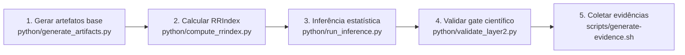

# MECADE Camada 2 - Implementação E2E

Este pacote implementa a Camada 2 (Metrologia Científica de Objetivos e Indicadores) do MECADE com artefatos obrigatórios, scripts de validação e *stack* Docker para Linux/macOS.

## Estrutura

| Caminho | Conteúdo |
|---|---|
| `planning/layer2/` | Artefatos obrigatórios da Camada 2 |
| `python/` | Scripts Python para geração, análise e validação |
| `scripts/` | Scripts shell de instalação e execução E2E |
| `observability/dashboards/` | Dashboard científico da Camada 2 |
| `docker/` | Configuração do Prometheus/Grafana/OpenTelemetry |
| `docker-compose.yml` | *Stack* local para observabilidade e análise |

## Requisitos

- Linux ou macOS
- Python 3.10+
- Docker + Compose (`docker compose` ou `docker-compose`)

## Quickstart

```bash
cd MECADE_IMPLEMENTACAO_CAMADA02
bash scripts/install.sh
bash scripts/run-e2e.sh
# alternativa equivalente:
# bash scripts/run_e2e.sh
```

## Subir a stack Docker

```bash
bash scripts/docker-up.sh
```

| Serviço | Endpoint |
|---|---|
| Prometheus | `http://localhost:9190` |
| Grafana (admin/admin) | `http://localhost:3100` |
| OpenTelemetry Collector | `http://localhost:9188` |
| Thanos Sidecar | `http://localhost:10902` |
| Thanos Query | `http://localhost:10903` |
| Jupyter Lab (token `mecade`) | `http://localhost:8898/lab?token=mecade` |

## Smoke test da stack

Depois de subir os serviços, rode um único comando para validar endpoints e serviços auxiliares:

```bash
bash scripts/smoke-test.sh
```

> O Sloth é disponibilizado como CLI no compose (execução *one-shot* para validação SLO as Code), e o smoke test valida sua execução.

## Derrubar a stack

```bash
bash scripts/docker-down.sh
```

## Fluxo E2E recomendado



| Etapa | Comando |
|---|---|
| 1. Gerar/atualizar artefatos base | `python python/generate_artifacts.py` |
| 2. Calcular RRIndex metrológico | `python python/compute_rrindex.py` |
| 3. Rodar inferência estatística de não regressão | `python python/run_inference.py` |
| 4. Validar gate científico da camada | `python python/validate_layer2.py` |
| 5. (Opcional) Coletar evidências | `bash scripts/generate-evidence.sh` |

## Observações

- Todos os arquivos obrigatórios da Camada 2 já vêm preenchidos para o cenário financeiro + microsserviços + Kubernetes.
- Ajuste fórmulas de SLI/SLO, limiares e regras estatísticas para o contexto real da sua campanha.
