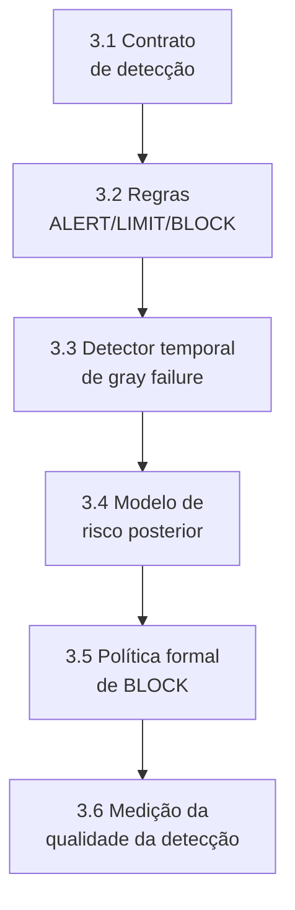

# HOWTO: Camada 3 (Detecção Científica e Decisão em Tempo Real) do MECADE

Este guia é o passo a passo E2E para implementar, testar e validar tecnicamente a Camada 3 em tempo real.

## Sumário

- [Stack recomendada](#stack-recomendada)
- [1. O que torna esta Camada 3 inovadora](#1-o-que-torna-esta-camada-3-inovadora)
- [2. Entregas obrigatórias da Camada 3](#2-entregas-obrigatórias-da-camada-3)
- [3. Implementação passo a passo](#3-implementação-passo-a-passo)
- [4. Validação de fato da Camada 3](#4-validação-de-fato-da-camada-3)
- [5. Protocolo de validação experimental](#5-protocolo-de-validação-experimental)
- [6. Comandos úteis](#6-comandos-úteis)
- [7. Definição de pronto (Definition of Done)](#7-definição-de-pronto-definition-of-done)
- [8. Fechamento técnico](#8-fechamento-técnico)

## Stack recomendada

| Componente | Função na Camada 3 |
|---|---|
| Prometheus + PrometheusRule | Detecção em janela curta |
| Alertmanager | Roteamento determinístico e deduplicação |
| OpenTelemetry + Tempo + Loki | Evidência causal de suporte |
| Flink CEP ou Benthos | Detecção de padrão temporal (*gray failure*) |
| Argo Events | Acionamento formal de `LIMIT`/`BLOCK` |

## 1. O que torna esta Camada 3 inovadora

A inovação da Camada 3 não é apenas "alertar mais rápido", e sim transformar detecção em mecanismo de inferência operacional:

1. Detecção em comitê (métrica + log + trace), não sinal único.
2. Limiar híbrido: limite duro de segurança + sensibilidade adaptativa supervisionada.
3. Captura de *gray failure* como fenômeno temporal, não apenas pico instantâneo.
4. Decisão baseada em risco posterior (*likelihood* × impacto), não somente *threshold*.
5. `BLOCK` acionado por critério formal e auditável, com latência medida.

## 2. Entregas obrigatórias da Camada 3

```bash
mkdir -p planning/layer3
mkdir -p planning/layer3/models
mkdir -p observability/rules
mkdir -p observability/patterns
mkdir -p automation/block
```

Arquivos obrigatórios:

| Artefato | Caminho |
|---|---|
| Contrato de detecção | `planning/layer3/detection-contract.yaml` |
| Modelo de risco posterior | `planning/layer3/models/risk-posterior-model.md` |
| Regras ALERT/LIMIT/BLOCK | `observability/rules/alert-limit-block.rules.yaml` |
| Padrão CEP de *gray failure* | `observability/patterns/gray-failure-cep.yaml` |
| Tracker de falso positivo/negativo | `planning/layer3/false-positive-negative-tracker.md` |
| Política formal de BLOCK | `automation/block/block-decision-policy.yaml` |
| Protocolo de validação | `planning/layer3/validation-protocol.md` |

Sem esses artefatos, a camada não atende ao rigor de decisão crítica.

## 3. Implementação passo a passo



### 3.1 Definir contrato de detecção

Exemplo em `planning/layer3/detection-contract.yaml`:

```yaml
service: checkout
steady_state:
  p99_latency_seconds: 0.300
  error_rate: 0.010
hard_safety_limits:
  max_p99_latency_seconds: 0.600
  max_error_rate: 0.030
adaptive_zone:
  alert_relative_deviation: 0.20
  limit_relative_deviation: 0.40
windows:
  instant: 60s
  accumulated: 10m
required_evidence:
  - metric_signal
  - trace_or_log_corroboration
```

Diferencial: separa explicitamente o limite duro (inviolável) da zona adaptativa.

### 3.2 Regras de ALERT/LIMIT/BLOCK com desvio acumulado

Exemplo em `observability/rules/alert-limit-block.rules.yaml`:

```yaml
groups:
  - name: mecade-layer3-scientific
    interval: 15s
    rules:
      - record: mecade:checkout:p99
        expr: histogram_quantile(0.99, sum(rate(http_request_duration_seconds_bucket{service="checkout"}[1m])) by (le))

      - record: mecade:checkout:error_rate
        expr: sum(rate(http_requests_total{service="checkout",status=~"5.."}[1m])) / sum(rate(http_requests_total{service="checkout"}[1m]))

      - record: mecade:checkout:relative_deviation
        expr: (mecade:checkout:p99 - 0.300) / 0.300

      - record: mecade:checkout:accum_dev_10m
        expr: sum_over_time(clamp_min(mecade:checkout:relative_deviation, 0)[10m:15s])

      - alert: MECADEAlert
        expr: mecade:checkout:relative_deviation > 0.20
        for: 1m
        labels:
          severity: warning
          mecade_axiom: ALERT

      - alert: MECADELimit
        expr: mecade:checkout:relative_deviation > 0.40 or mecade:checkout:accum_dev_10m > 8
        for: 30s
        labels:
          severity: critical
          mecade_axiom: LIMIT

      - alert: MECADEBlockHardSafety
        expr: mecade:checkout:p99 > 0.600 or mecade:checkout:error_rate > 0.030
        for: 15s
        labels:
          severity: critical
          mecade_axiom: BLOCK
```

### 3.3 Definir detector temporal de gray failure

Exemplo em `observability/patterns/gray-failure-cep.yaml`:

```yaml
pattern_id: gray_failure_latency_drift
window: 12m
conditions:
  - metric: p99_latency
    trend: increasing
    min_slope_per_minute: 0.01
  - metric: error_rate
    op: lte
    value: 0.01
  - metric: retry_rate
    op: gte
    value: 0.12
decision:
  emit_event: GRAY_FAILURE_SUSPECTED
  confidence_min: 0.8
```

Diferencial: modela degradação progressiva com padrão temporal, não limiar isolado.

### 3.4 Modelo de risco posterior para decisão

Em `planning/layer3/models/risk-posterior-model.md`, documente:

```text
PosteriorRisk = P(falha_critica | sinais) * ImpactoDominio

Regra:
- ALERT quando PosteriorRisk >= 0.30
- LIMIT quando PosteriorRisk >= 0.55
- BLOCK quando PosteriorRisk >= 0.80 ou hard_safety_limits violados
```

Diferencial: decisão baseada em risco condicional e criticidade de domínio.

### 3.5 Política formal de BLOCK

Exemplo em `automation/block/block-decision-policy.yaml`:

```yaml
block_policy:
  trigger_any:
    - alert_name: MECADEBlockHardSafety
    - posterior_risk_gte: 0.80
  require_evidence:
    - metric_signal
    - trace_or_log_corroboration
  actions:
    - stop_fault_injection: true
    - apply_safe_state_runbook: true
  max_decision_latency_ms: 1500
  audit_required: true
```

### 3.6 Medir qualidade da detecção

Em `planning/layer3/false-positive-negative-tracker.md`, registre por ciclo:

| Indicador | Descrição |
|---|---|
| Precision e recall | Para eventos críticos |
| Taxa de falso positivo | ALERT/LIMIT |
| Taxa de falso negativo | *Gray failure* |
| *Lead-time-to-failure* | Tempo entre ALERT e violação LIMIT/BLOCK |
| Tempo de decisão | Do momento da detecção até o acionamento de BLOCK |

Sem isso, não há evidência de superioridade da camada.

## 4. Validação de fato da Camada 3

A camada está validada quando detecta cedo, decide corretamente e bloqueia com baixa latência sem disparar excesso de falsos positivos.

| # | Critério go/no-go | Condição de aprovação |
|---|---|---|
| 1 | Sensibilidade temporal | *Gray failure* detectado antes da violação crítica em >= 70% dos cenários |
| 2 | Especificidade operacional | Falso positivo de LIMIT/BLOCK abaixo do limiar acordado (ex.: <= 10%) |
| 3 | Latência de decisão | BLOCK acionado dentro da meta (ex.: <= 1.5s) após critério formal |
| 4 | Robustez de evidência | ALERT/LIMIT com corroboração de ao menos dois sinais independentes |
| 5 | Reprodutibilidade | Mesmos cenários produzem padrões de decisão equivalentes em repetições independentes |

Se os 5 itens passarem, a Camada 3 está validada.

## 5. Protocolo de validação experimental

Exemplo em `planning/layer3/validation-protocol.md`:

| Cenário | Descrição | Critério de validação |
|---|---|---|
| A - Drift progressivo sem *outage* | Aumentar a latência em degraus a cada 2 minutos | Detecção de *gray failure* antes de 5xx massivo |
| B - Ruído sem falha real | Injetar variabilidade controlada de curta duração | LIMIT/BLOCK não disparam indevidamente |
| C - Hard safety | Violar o limite duro de p99/error_rate | BLOCK no tempo alvo e transição para estado seguro |
| D - *Ablation* de sinais | Remover log/trace e repetir o cenário | Medir a degradação da qualidade de decisão do comitê |

## 6. Comandos úteis

```bash
# aplicar regras cientificas
kubectl apply -f observability/rules/alert-limit-block.rules.yaml

# validar regras no Prometheus Operator
kubectl -n monitoring get prometheusrules

# acompanhar alertas
kubectl -n monitoring logs deploy/alertmanager-main --tail=200

# validar sensor de bloqueio
kubectl -n argo-events get sensors
kubectl -n argo get workflows
```

## 7. Definição de pronto (Definition of Done)

A Camada 3 é considerada `DONE` quando:

- O contrato de detecção (limite duro + zona adaptativa) está versionado.
- O detector de *gray failure* temporal está ativo e validado.
- `BLOCK` possui política formal com latência alvo e auditoria.
- A qualidade da detecção (precision/recall/falso positivo) está medida.
- Os resultados são reprodutíveis em múltiplas repetições.

## 8. Fechamento técnico

Com esta abordagem, a Camada 3 transforma detecção em decisão operacional formal, com critério de risco, latência alvo e evidência auditável.
