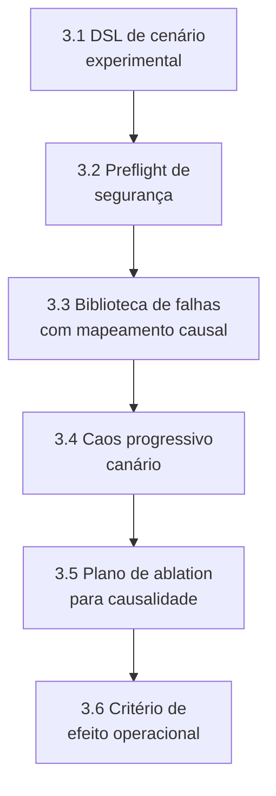
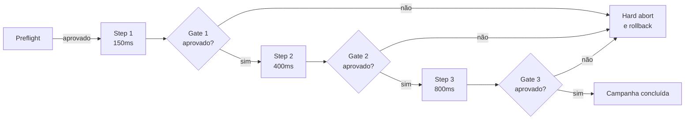

# HOWTO: Camada 4 (Execução Experimental Científica de Falhas) do MECADE

Este guia é o roteiro E2E para executar, testar e validar tecnicamente experimentos de falha na Camada 4.

## Sumário

- [Stack recomendada](#stack-recomendada)
- [1. O que torna esta Camada 4 inovadora](#1-o-que-torna-esta-camada-4-inovadora)
- [2. Entregas obrigatórias da Camada 4](#2-entregas-obrigatórias-da-camada-4)
- [3. Implementação passo a passo](#3-implementação-passo-a-passo)
- [4. Validação de fato da Camada 4](#4-validação-de-fato-da-camada-4)
- [5. Protocolo de validação experimental](#5-protocolo-de-validação-experimental)
- [6. Comandos úteis](#6-comandos-úteis)
- [7. Definição de pronto (Definition of Done)](#7-definição-de-pronto-definition-of-done)
- [8. Erros comuns a evitar](#8-erros-comuns-a-evitar)
- [9. Fechamento técnico](#9-fechamento-técnico)

## Stack recomendada

| Componente | Função na Camada 4 |
|---|---|
| LitmusChaos + Chaos Mesh | Injeção de falhas em diferentes níveis |
| Kubernetes + Istio | Controle de escopo e rede |
| Argo Workflows | Orquestração reprodutível |
| Keptn ou *evaluator* Python customizado | Avaliação automatizada do experimento |
| Prometheus + Tempo + Loki | Evidências operacionais e causais |

## 1. O que torna esta Camada 4 inovadora

A inovação não é apenas "rodar chaos", e sim executar falhas como experimento controlado com validade interna:

1. DSL de cenário para padronizar injeção, escopo, duração e *rollback*.
2. Execução progressiva canário, com expansão condicionada a *gates*.
3. *Preflight* formal de segurança antes de cada rodada.
4. Desenho de *ablation* (com/sem mecanismo) para identificar causalidade de mitigação.
5. Medida de efeito operacional com critério estatístico, não apenas observação visual.

## 2. Entregas obrigatórias da Camada 4

```bash
mkdir -p chaos/layer4
mkdir -p chaos/layer4/dsl
mkdir -p chaos/layer4/experiments
mkdir -p chaos/layer4/workflows
mkdir -p chaos/layer4/safety
mkdir -p chaos/layer4/evaluation
```

Arquivos obrigatórios:

| Artefato | Caminho |
|---|---|
| DSL de cenário | `chaos/layer4/dsl/scenario-spec.yaml` |
| Checklist de *preflight* | `chaos/layer4/safety/preflight-checklist.yaml` |
| Biblioteca de falhas | `chaos/layer4/experiments/fault-library.yaml` |
| Workflow de caos progressivo | `chaos/layer4/workflows/progressive-chaos.yaml` |
| Critério de tamanho de efeito | `chaos/layer4/evaluation/effect-size-criteria.md` |
| Plano de *ablation* | `chaos/layer4/evaluation/ablation-plan.md` |
| Protocolo de validação | `chaos/layer4/validation-protocol.md` |

Sem esses artefatos, a camada não comprova efetividade com rigor.

## 3. Implementação passo a passo



### 3.1 Definir DSL de cenário experimental

Exemplo em `chaos/layer4/dsl/scenario-spec.yaml`:

```yaml
scenario_id: S4_NET_LATENCY_PROGRESSIVE
service_under_test: checkout
hypothesis_ref: H1
fault_model:
  type: network_latency
  target: checkout->payment
  profile:
    - step: 1
      delay_ms: 150
      duration_s: 120
    - step: 2
      delay_ms: 400
      duration_s: 120
    - step: 3
      delay_ms: 800
      duration_s: 120
blast_radius:
  namespace: shop
  max_replicas_affected: 1
safety:
  hard_abort:
    p99_latency_seconds_gt: 0.600
    error_rate_gt: 0.030
rollback:
  remove_fault_object: true
  restore_replicas: true
```

Diferencial: a DSL permite reexecução idêntica e comparação entre rodadas.

### 3.2 Preflight de segurança automatizado

Exemplo em `chaos/layer4/safety/preflight-checklist.yaml`:

```yaml
checks:
  - id: min_replicas_ready
    query: "k8s_deployment_ready_replicas{deployment='checkout'} >= 3"
  - id: budget_available
    query: "mecade:remaining_error_budget_ratio > 0.20"
  - id: no_active_incident
    query: "incident_open_critical == 0"
  - id: rollback_path_valid
    query: "runbook_block_safe_state_available == 1"
on_fail: block_experiment
```

Sem *preflight* aprovado, o experimento não inicia.

### 3.3 Biblioteca de falhas com mapeamento causal

Exemplo em `chaos/layer4/experiments/fault-library.yaml`:

```yaml
faults:
  - id: pod_delete
    tool: litmus
    layer: compute
    expected_effect: short_availability_drop
    causal_path: pod_eviction->reschedule->recovery

  - id: network_latency
    tool: istio
    layer: network
    expected_effect: p99_drift_and_timeout
    causal_path: queueing->retry->tail_latency

  - id: cpu_hog
    tool: litmus
    layer: resource
    expected_effect: service_degradation
    causal_path: throttling->slow_response->error_spike
```

### 3.4 Orquestrar caos progressivo canário

Exemplo em `chaos/layer4/workflows/progressive-chaos.yaml`:

```yaml
apiVersion: argoproj.io/v1alpha1
kind: Workflow
metadata:
  generateName: mecade-progressive-chaos-
  namespace: argo
spec:
  entrypoint: progressive
  templates:
    - name: progressive
      steps:
        - - name: preflight
            template: run
            arguments:
              parameters:
                - name: cmd
                  value: "python chaos/layer4/safety/run_preflight.py"
        - - name: inject-step-1
            template: run
            arguments:
              parameters:
                - name: cmd
                  value: "python chaos/layer4/runner.py --step 1"
        - - name: gate-step-1
            template: run
            arguments:
              parameters:
                - name: cmd
                  value: "python chaos/layer4/evaluation/gate.py --step 1"
        - - name: inject-step-2
            template: run
            arguments:
              parameters:
                - name: cmd
                  value: "python chaos/layer4/runner.py --step 2"

    - name: run
      inputs:
        parameters:
          - name: cmd
      container:
        image: python:3.12-slim
        command: ["sh", "-c"]
        args: ["{{inputs.parameters.cmd}}"]
```

Diferencial: cada etapa só avança com *gate* aprovado.



### 3.5 Plano de ablation para causalidade

Em `chaos/layer4/evaluation/ablation-plan.md`, documente as condições experimentais:

| Condição | Descrição |
|---|---|
| 1 | Baseline reativo, sem ALERT/LIMIT/BLOCK |
| 2 | Execução apenas com ALERT |
| 3 | Execução com ALERT + LIMIT |
| 4 | Execução completa com ALERT + LIMIT + BLOCK |

Objetivo: isolar a contribuição causal de cada mecanismo.

### 3.6 Definir critério de efeito operacional

Exemplo em `chaos/layer4/evaluation/effect-size-criteria.md`:

```text
Metrica primaria:
- MTTR

Criterio de sucesso:
- Reducao >= 15% vs baseline reativo
- IC95% de delta_MTTR abaixo de 0

Restricoes de seguranca:
- availability >= 99.5%
- p99 <= 450ms apos recovery
```

## 4. Validação de fato da Camada 4

A camada está validada quando a injeção é controlada, causalmente interpretável e reprodutível.

| # | Critério go/no-go | Condição de aprovação |
|---|---|---|
| 1 | Controle de escopo | *Blast radius* respeitado em todas as rodadas |
| 2 | Segurança experimental | *Preflight* aprovado e *hard-abort* funcional |
| 3 | Reprodutibilidade | O cenário DSL reproduz comportamento equivalente em repetições |
| 4 | Causalidade operacional | A *ablation* mostra ganho incremental dos mecanismos de controle |
| 5 | Efetividade estatística | Ganho de MTTR/RTO com critério de efeito e confiança |

Se os 5 itens passarem, a Camada 4 está validada.

## 5. Protocolo de validação experimental

Exemplo em `chaos/layer4/validation-protocol.md`:

| Cenário | Descrição | Critério de validação |
|---|---|---|
| A - *Canary progression* | Executar step 1 (150ms), step 2 (400ms) e step 3 (800ms) | Gates aprovados por etapa antes de escalar o *fault* |
| B - *Ablation* de controles | Repetir o mesmo perfil de falha em quatro condições (baseline, ALERT, ALERT+LIMIT, completo) | Medir delta de MTTR e taxa de violação |
| C - *Hard abort* | Forçar violação do limite duro | Interrupção no tempo alvo e *rollback* para estado seguro |
| D - Repetibilidade | Executar no mínimo N repetições por cenário | Comparar variabilidade entre lotes |

## 6. Comandos úteis

```bash
# aplicar experimentos/faults
kubectl apply -f chaos/layer4/experiments/

# iniciar workflow progressivo
argo -n argo submit chaos/layer4/workflows/progressive-chaos.yaml

# acompanhar resultados litmus/mesh
kubectl -n litmus get chaosresults
kubectl -n shop get virtualservice

# rollback emergencial
python chaos/layer4/safety/force_safe_state.py
```

## 7. Definição de pronto (Definition of Done)

A Camada 4 é considerada `DONE` quando:

- A DSL de cenário está versionada e em uso.
- O *preflight* de segurança bloqueia execução insegura.
- O *workflow* progressivo canário funciona com *gates*.
- O plano de *ablation* foi executado e analisado.
- O efeito operacional foi demonstrado com critério estatístico.

## 8. Erros comuns a evitar

| Erro | Consequência |
|---|---|
| Injetar falha sem desenho experimental causal | Resultado não permite atribuição de efeito |
| Escalar intensidade sem *gate* intermediário | Risco de violar o *blast radius* sem controle |
| Não medir o efeito incremental dos mecanismos de controle | *Ablation* perde valor explicativo |
| Confundir observação pontual com evidência estatística | Conclusões não são generalizáveis |
| Não documentar *rollback* e *hard-abort* em tempo alvo | Falha de segurança operacional do experimento |

## 9. Fechamento técnico

Com esta abordagem, a Camada 4 organiza o caos de forma controlada, progressiva e mensurável, com *gates* claros de segurança e critério de efeito.
