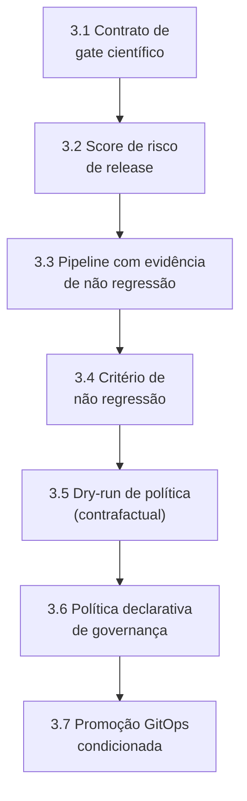
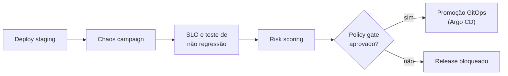

# HOWTO: Camada 5 (Governança Científica de CI/CD e Resilience Gates) do MECADE

Este guia é a referência E2E para implementar, testar e validar tecnicamente a governança de release na Camada 5.

## Sumário

- [Stack recomendada](#stack-recomendada)
- [1. O que torna esta Camada 5 inovadora](#1-o-que-torna-esta-camada-5-inovadora)
- [2. Entregas obrigatórias da Camada 5](#2-entregas-obrigatórias-da-camada-5)
- [3. Implementação passo a passo](#3-implementação-passo-a-passo)
- [4. Validação de fato da Camada 5](#4-validação-de-fato-da-camada-5)
- [5. Protocolo de validação experimental](#5-protocolo-de-validação-experimental)
- [6. Comandos úteis](#6-comandos-úteis)
- [7. Definição de pronto (Definition of Done)](#7-definição-de-pronto-definition-of-done)
- [8. Erros comuns a evitar](#8-erros-comuns-a-evitar)
- [9. Fechamento técnico](#9-fechamento-técnico)

## Stack recomendada

| Componente | Função na Camada 5 |
|---|---|
| GitHub Actions ou GitLab CI | Orquestração de *pipeline* |
| Argo CD | Promoção GitOps determinística |
| Open Policy Agent + Conftest | Governança declarativa |
| LitmusChaos/Chaos Mesh | *Fault tests* no SDLC |
| Prometheus + Thanos | Consulta histórica de SLO/SLI |
| MLflow | Rastreio de versão de política e *score* de gate |

## 1. O que torna esta Camada 5 inovadora

A inovação não é apenas "rodar caos no *pipeline*", e sim tomar decisão de *deploy* orientada por evidência:

1. *Gate* multiobjetivo (desempenho + risco + custo de recuperação).
2. Política de release com risco posterior explícito.
3. Simulação contrafactual de política antes do *enforce*.
4. Promoção baseada em critério estatístico de não regressão.
5. Trilha de decisão auditável (quem aprovou, com quais evidências).

## 2. Entregas obrigatórias da Camada 5

```bash
mkdir -p cicd/layer5
mkdir -p cicd/layer5/workflows
mkdir -p cicd/layer5/policies
mkdir -p cicd/layer5/models
mkdir -p cicd/layer5/evaluation
```

Arquivos obrigatórios:

| Artefato | Caminho |
|---|---|
| Contrato de gate científico | `cicd/layer5/release-gate-contract.yaml` |
| Workflow do gate de resiliência | `cicd/layer5/workflows/resilience-scientific-gate.yml` |
| Política declarativa de governança | `cicd/layer5/policies/release-governance.rego` |
| Modelo de score de risco | `cicd/layer5/models/risk-score-model.md` |
| Critério de não regressão | `cicd/layer5/evaluation/non-regression-criteria.md` |
| Protocolo de *dry-run* de política | `cicd/layer5/evaluation/policy-dryrun-protocol.md` |
| Protocolo de validação | `cicd/layer5/validation-protocol.md` |

Sem esses artefatos, a camada não sustenta uma decisão tecnicamente defensável.

## 3. Implementação passo a passo



### 3.1 Definir contrato de gate científico

Exemplo em `cicd/layer5/release-gate-contract.yaml`:

```yaml
gate:
  id: mecade_release_gate_v1
  required_stages:
    - build
    - deploy_staging
    - chaos_test
    - slo_validation
    - risk_scoring
    - policy_gate
inputs:
  - slo_results
  - chaos_results
  - risk_score
  - rollback_cost_estimate
decision:
  mode: multiobjective
  approve_if:
    - slo_pass == true
    - non_regression_pass == true
    - risk_score <= 0.45
    - rollback_cost_estimate <= threshold
```

Diferencial: o *gate* explicita as variáveis de decisão e o critério composto.

### 3.2 Modelar score de risco de release

Em `cicd/layer5/models/risk-score-model.md`:

```text
RiskScore = w1*P(SLO_violation) + w2*P(recovery_delay) + w3*change_complexity + w4*dependency_instability

Faixas:
- <= 0.30: baixo risco (promocao automatica)
- 0.31 - 0.45: risco moderado (promocao com dupla aprovacao)
- > 0.45: bloquear release
```

| Faixa de RiskScore | Decisão |
|---|---|
| `<= 0.30` | Promoção automática (baixo risco) |
| `0.31` a `0.45` | Promoção com dupla aprovação (risco moderado) |
| `> 0.45` | Bloquear release |

Diferencial: o risco é tratado como variável quantitativa, não opinativa.

### 3.3 Pipeline com evidência estatística de não regressão

Exemplo em `cicd/layer5/workflows/resilience-scientific-gate.yml`:

```yaml
name: resilience-scientific-gate
on:
  push:
    branches: ["main"]
jobs:
  gate:
    runs-on: ubuntu-latest
    steps:
      - uses: actions/checkout@v4

      - name: Deploy staging
        run: kubectl apply -f k8s/staging/

      - name: Chaos campaign
        run: bash cicd/layer5/scripts/run_chaos_campaign.sh

      - name: SLO and non-regression test
        run: python cicd/layer5/evaluation/non_regression_test.py

      - name: Risk scoring
        run: python cicd/layer5/evaluation/compute_risk_score.py

      - name: Policy gate
        run: conftest test cicd/layer5/release-gate-contract.yaml -p cicd/layer5/policies/
```



### 3.4 Critério de não regressão

Exemplo em `cicd/layer5/evaluation/non-regression-criteria.md`:

```text
Metrica primaria: MTTR
Metricas secundarias: availability, p99, error_rate

Aprovacao:
- delta_MTTR <= 0 com IC95% nao cruzando degradacao relevante
- availability nao piora alem de epsilon
- p99 nao excede limite operacional em janela de observacao
```

Diferencial: o *deploy* depende de evidência estatística, não apenas de um *check* binário.

### 3.5 Dry-run de política (contrafactual)

Exemplo em `cicd/layer5/evaluation/policy-dryrun-protocol.md`:

```text
Antes de promover nova politica de gate:
1. Reexecutar historico de 30 releases em modo simulacao.
2. Medir quantos releases seriam bloqueados/aprovados.
3. Quantificar falsos bloqueios e bloqueios perdidos.
4. Aprovar somente se melhora o trade-off risco x throughput de entrega.
```

Diferencial: a política é validada *offline* antes de afetar o *pipeline* real.

### 3.6 Política declarativa de governança

Exemplo em `cicd/layer5/policies/release-governance.rego`:

```rego
package mecade.release

deny[msg] {
  input.gate.decision.mode != "multiobjective"
  msg := "gate deve operar em modo multiobjetivo"
}

deny[msg] {
  not input.gate.decision.approve_if[_] == "risk_score <= 0.45"
  msg := "criterio de risco maximo ausente"
}
```

### 3.7 Promoção GitOps condicionada

| Etapa | Descrição |
|---|---|
| 1 | O *gate* científico aprova o release com evidências |
| 2 | O *pipeline* gera um artefato de decisão (score, testes, hash da política) |
| 3 | Somente então ocorre o *merge* para a branch de ambiente |
| 4 | O Argo CD sincroniza a produção de forma determinística |

## 4. Validação de fato da Camada 5

A Camada 5 está validada quando o release é governado por evidência reprodutível, não por aprovação manual *ad hoc*.

| # | Critério go/no-go | Condição de aprovação |
|---|---|---|
| 1 | Validade de decisão | O *gate* usa variáveis mensuráveis e regra formal de aprovação |
| 2 | Não regressão comprovada | O *pipeline* reprova releases com degradação estatisticamente relevante |
| 3 | Política robusta | O *dry-run* mostra melhora de risco sem colapsar *throughput* |
| 4 | Rastreabilidade | Cada decisão de release tem artefato de evidência e *hash* de política |
| 5 | Reprodutibilidade | A reexecução dos mesmos insumos produz a mesma decisão |

Se os 5 itens passarem, a Camada 5 está validada.

## 5. Protocolo de validação experimental

Exemplo em `cicd/layer5/validation-protocol.md`:

| Cenário | Descrição | Critério de validação |
|---|---|---|
| A - Regressão controlada | Introduzir degradação pequena de p99 | Reprovação por não regressão |
| B - Falso bloqueio | Simular ruído sem regressão real | Taxa de falso bloqueio abaixo do limite |
| C - Dry-run de política nova | Executar política candidata em histórico de releases | Comparação A/B *offline* com a política atual |
| D - Caminho feliz | Release sem violação, risco baixo e custo de *rollback* aceitável | Promoção automática por GitOps |

## 6. Comandos úteis

```bash
# validar contrato e policy
conftest test cicd/layer5/release-gate-contract.yaml -p cicd/layer5/policies/

# executar teste de nao regressao
python cicd/layer5/evaluation/non_regression_test.py

# calcular risco de release
python cicd/layer5/evaluation/compute_risk_score.py

# disparar workflow
gh workflow run resilience-scientific-gate.yml

# acompanhar promocao
argocd app get checkout-prod
```

## 7. Definição de pronto (Definition of Done)

A Camada 5 é considerada `DONE` quando:

- O contrato multiobjetivo de *gate* está versionado.
- A política de governança é validada por *dry-run* histórico.
- A não regressão estatística está no caminho crítico de release.
- O risco de release é calculado e usado na decisão.
- A promoção GitOps ocorre apenas após o *gate* científico ser aprovado.

## 8. Erros comuns a evitar

| Erro | Consequência |
|---|---|
| Tratar o *gate* como checklist binário, sem modelo de risco | Decisão perde sensibilidade a variações relevantes |
| Aprovar release sem critério de não regressão estatística | Degradações pequenas e reais passam despercebidas |
| Alterar a política sem validação contrafactual (*dry-run*) | Mudanças podem aumentar bloqueios ou riscos sem aviso |
| Não registrar evidência de decisão para auditoria | Decisão deixa de ser rastreável e defensável |
| Confundir velocidade de entrega com qualidade de decisão | *Throughput* é otimizado às custas de segurança |

## 9. Fechamento técnico

Com esta abordagem, a Camada 5 torna a decisão de release objetiva, rastreável e reprodutível, conectando risco, não regressão e política declarativa.
