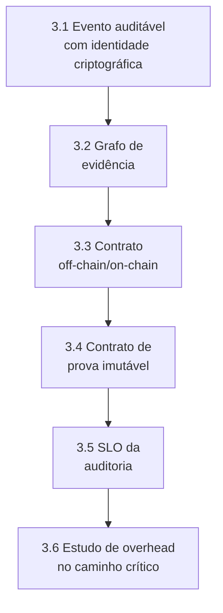
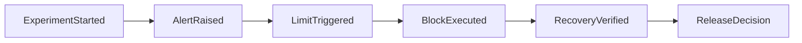

# HOWTO: Camada 6 (Auditoria Científica, Prova Criptográfica e Governança Determinística) do MECADE

Este guia é o roteiro E2E para implementar, testar e validar tecnicamente a auditoria da Camada 6 com prova verificável.

## Sumário

- [Stack recomendada](#stack-recomendada)
- [1. O que torna esta Camada 6 inovadora](#1-o-que-torna-esta-camada-6-inovadora)
- [2. Entregas obrigatórias da Camada 6](#2-entregas-obrigatórias-da-camada-6)
- [3. Implementação passo a passo](#3-implementação-passo-a-passo)
- [4. Validação de fato da Camada 6](#4-validação-de-fato-da-camada-6)
- [5. Protocolo de validação experimental](#5-protocolo-de-validação-experimental)
- [6. Comandos úteis](#6-comandos-úteis)
- [7. Definição de pronto (Definition of Done)](#7-definição-de-pronto-definition-of-done)
- [8. Erros comuns a evitar](#8-erros-comuns-a-evitar)
- [9. Fechamento técnico](#9-fechamento-técnico)

## Stack recomendada

| Componente | Função na Camada 6 |
|---|---|
| Apache Kafka | Buffer assíncrono e desacoplamento do caminho crítico |
| OpenTelemetry Collector | Normalização e assinatura de eventos |
| MinIO ou S3-compatible | Payload completo off-chain |
| Hyperledger Fabric ou immudb | Âncora imutável de prova |
| Vault + Sigstore/Cosign | Gestão criptográfica e assinatura |
| Prometheus + Grafana | SLO da auditoria |

## 1. O que torna esta Camada 6 inovadora

A inovação não é apenas "registrar no blockchain", e sim criar prova auditável com hipótese testável:

1. Modelo de evidência em duas camadas: conteúdo completo off-chain + prova compacta on-chain.
2. Grafo de proveniência (evento → decisão → ação → efeito) com verificabilidade automatizada.
3. SLO da auditoria como sistema crítico independente (latência, completude, integridade).
4. Mensuração do *overhead* da auditoria no caminho crítico operacional.
5. Protocolo experimental para detectar adulteração, perda e reordenação de eventos.

## 2. Entregas obrigatórias da Camada 6

```bash
mkdir -p audit/layer6
mkdir -p audit/layer6/schemas
mkdir -p audit/layer6/provenance
mkdir -p audit/layer6/pipeline
mkdir -p audit/layer6/ledger
mkdir -p audit/layer6/evaluation
```

Arquivos obrigatórios:

| Artefato | Caminho |
|---|---|
| Schema do evento auditável | `audit/layer6/schemas/audit-event.schema.json` |
| Modelo do grafo de proveniência | `audit/layer6/provenance/evidence-graph-model.yaml` |
| Contrato off-chain/on-chain | `audit/layer6/pipeline/offchain-onchain-contract.yaml` |
| Contrato de prova imutável | `audit/layer6/ledger/proof-contract.md` |
| SLO da auditoria | `audit/layer6/evaluation/audit-slo.yaml` |
| Estudo de *overhead* | `audit/layer6/evaluation/overhead-study.md` |
| Protocolo de validação | `audit/layer6/validation-protocol.md` |

Sem esses artefatos, a camada não sustenta a alegação de imutabilidade e conformidade forte.

## 3. Implementação passo a passo



### 3.1 Padronizar evento auditável com identidade criptográfica

Exemplo em `audit/layer6/schemas/audit-event.schema.json`:

```json
{
  "$schema": "http://json-schema.org/draft-07/schema#",
  "title": "MECADEAuditEvent",
  "type": "object",
  "required": [
    "event_id",
    "parent_event_id",
    "experiment_id",
    "timestamp",
    "layer",
    "event_type",
    "payload_hash",
    "signature",
    "trace_id"
  ],
  "properties": {
    "event_id": { "type": "string" },
    "parent_event_id": { "type": "string" },
    "experiment_id": { "type": "string" },
    "timestamp": { "type": "string" },
    "layer": { "type": "string", "enum": ["L3", "L4", "L5", "L6", "L7"] },
    "event_type": { "type": "string" },
    "payload_uri": { "type": "string" },
    "payload_hash": { "type": "string" },
    "signature": { "type": "string" },
    "trace_id": { "type": "string" },
    "actor": { "type": "string" },
    "policy_version": { "type": "string" }
  }
}
```

Diferencial: permite reconstruir a cadeia causal e a autoria de cada decisão.

### 3.2 Definir modelo de grafo de evidência

Exemplo em `audit/layer6/provenance/evidence-graph-model.yaml`:

```yaml
nodes:
  - ExperimentStarted
  - AlertRaised
  - LimitTriggered
  - BlockExecuted
  - RecoveryVerified
  - ReleaseDecision
edges:
  - from: ExperimentStarted
    to: AlertRaised
  - from: AlertRaised
    to: LimitTriggered
  - from: LimitTriggered
    to: BlockExecuted
  - from: BlockExecuted
    to: RecoveryVerified
constraints:
  - every_node_must_have_event_id
  - every_edge_must_reference_parent_event_id
  - graph_must_be_acyclic_per_experiment
```



Diferencial: trilha forense consultável, não apenas sequência textual de logs.

### 3.3 Contrato off-chain/on-chain

Exemplo em `audit/layer6/pipeline/offchain-onchain-contract.yaml`:

```yaml
offchain:
  storage: minio
  object_key_pattern: "YYYY/MM/DD/{experiment_id}/{event_id}.json"
  required_metadata:
    - payload_hash
    - signature
    - trace_id
onchain:
  anchor:
    - event_id
    - payload_hash
    - timestamp
    - actor
rules:
  - reject_if_signature_invalid
  - reject_if_hash_missing
  - reconcile_if_ledger_unavailable
```

### 3.4 Definir contrato de prova imutável

Exemplo em `audit/layer6/ledger/proof-contract.md`:

```text
Operacoes:
- PutProof(event_id, payload_hash, parent_event_id, actor, timestamp)
- GetProof(event_id)
- VerifyProof(event_id, payload_hash)

Propriedades:
- event_id unico por experimento
- payload_hash imutavel apos commit
- parent_event_id obrigatorio para manter encadeamento causal
```

### 3.5 SLO da auditoria

Exemplo em `audit/layer6/evaluation/audit-slo.yaml`:

```yaml
audit_slo:
  ingest_latency_p95_ms_lte: 300
  chain_write_latency_p95_ms_lte: 500
  event_loss_rate_eq: 0
  proof_mismatch_rate_eq: 0
  max_reconciliation_lag_seconds: 120
```

Diferencial: a auditoria passa a ter qualidade de serviço explicitamente monitorada.

### 3.6 Estudo de overhead no caminho crítico

Em `audit/layer6/evaluation/overhead-study.md`, documente:

| Item | Descrição |
|---|---|
| 1 | Tempo de decisão sem auditoria |
| 2 | Tempo de decisão com auditoria assíncrona ativa |
| 3 | Delta de latência e IC 95% |
| 4 | Critério de aceitabilidade (ex.: *overhead* <= 5%) |

Sem isso, a alegação "não impacta o caminho crítico" não é cientificamente sustentada.

## 4. Validação de fato da Camada 6

A camada está validada quando prova integridade, completude e baixo impacto operacional com evidência quantitativa.

| # | Critério go/no-go | Condição de aprovação |
|---|---|---|
| 1 | Integridade ponta a ponta | `VerifyProof` confirma o hash off-chain para eventos amostrados e críticos |
| 2 | Completude de proveniência | Grafo de evidência sem lacunas para experimentos auditados |
| 3 | Robustez a falha | Ledger indisponível não gera perda de evento, apenas atraso de ancoragem |
| 4 | Segurança criptográfica | Evento sem assinatura válida é rejeitado e contabilizado |
| 5 | Overhead controlado | Impacto de latência no caminho crítico dentro do limite definido |

Se os 5 itens passarem, a Camada 6 está validada.

## 5. Protocolo de validação experimental

Exemplo em `audit/layer6/validation-protocol.md`:

| Cenário | Descrição | Critério de validação |
|---|---|---|
| A - Integridade nominal | Publicar evento assinado, persistir payload off-chain e ancorar hash on-chain | `VerifyProof == true` |
| B - Adulteração de payload | Alterar payload após persistência e recalcular hash | *Mismatch* detectado automaticamente |
| C - Ledger indisponível | Derrubar peer/orderer temporariamente | Backlog em Kafka e reconciliação total após o retorno |
| D - Reordenação de eventos | Publicar eventos fora de ordem | Reconstrução correta via `parent_event_id` |
| E - Medição de overhead | Comparar a latência de decisão com e sem auditoria | Avaliar delta e IC 95% |

## 6. Comandos úteis

```bash
# validar schema de evento (exemplo)
python audit/layer6/tools/validate_event_schema.py

# listar topicos kafka
kafka-topics.sh --bootstrap-server kafka:9092 --list

# consultar prova on-chain (exemplo)
peer chaincode query -C mecade-audit -n auditcc -c '{"Args":["GetProof","evt-001"]}'

# verificar objeto no minio
mc ls local/mecade-audit/

# observar SLO da auditoria
kubectl -n monitoring port-forward svc/prometheus-server 9090:80
```

## 7. Definição de pronto (Definition of Done)

A Camada 6 é considerada `DONE` quando:

- Os contratos de evento, proveniência e prova estão versionados.
- As trilhas críticas possuem verificabilidade automatizada de integridade.
- A reconciliação após falha de ledger foi testada e aprovada.
- O SLO da auditoria está em operação contínua.
- O estudo de *overhead* comprova impacto controlado no caminho crítico.

## 8. Erros comuns a evitar

| Erro | Consequência |
|---|---|
| Confundir imutabilidade com retenção de log comum | Prova não resiste a contestação forense |
| Não medir o impacto da auditoria na latência operacional | Alegação de baixo impacto fica sem evidência |
| Não provar a completude da cadeia de evidência | Lacunas no grafo de proveniência comprometem a auditoria |
| Usar blockchain sem definir propriedade verificável de prova | Ancoragem on-chain perde valor probatório |
| Ignorar cenários de indisponibilidade e reordenação de eventos | Sistema falha sob condições reais de operação |

## 9. Fechamento técnico

Com esta abordagem, a Camada 6 entrega auditoria com integridade verificável, proveniência completa e controle mensurável de *overhead* no caminho crítico.
