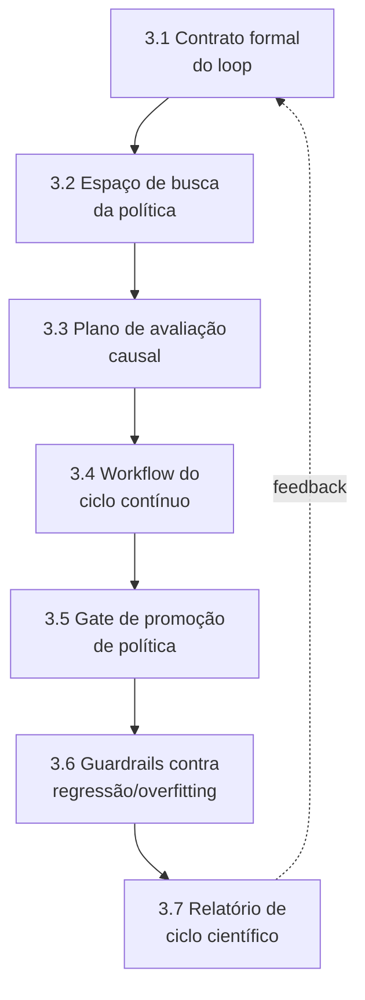
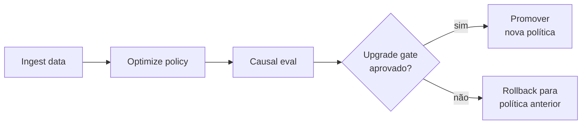

# HOWTO: Camada 7 (Aprendizado Causal Contínuo e Evolução de Políticas) do MECADE

Este guia é o passo a passo E2E para implementar, testar e validar tecnicamente a evolução de políticas na Camada 7.

## Sumário

- [Stack recomendada](#stack-recomendada)
- [1. O que torna esta Camada 7 inovadora](#1-o-que-torna-esta-camada-7-inovadora)
- [2. Entregas obrigatórias da Camada 7](#2-entregas-obrigatórias-da-camada-7)
- [3. Implementação passo a passo](#3-implementação-passo-a-passo)
- [4. Validação de fato da Camada 7](#4-validação-de-fato-da-camada-7)
- [5. Protocolo de validação experimental](#5-protocolo-de-validação-experimental)
- [6. Comandos úteis](#6-comandos-úteis)
- [7. Definição de pronto (Definition of Done)](#7-definição-de-pronto-definition-of-done)
- [8. Erros comuns a evitar](#8-erros-comuns-a-evitar)
- [9. Fechamento técnico](#9-fechamento-técnico)

## Stack recomendada

| Componente | Função na Camada 7 |
|---|---|
| Argo Workflows | Orquestração periódica do *loop* |
| PostgreSQL + DuckDB | Base histórica e análise |
| MLflow | Rastreio de versões, parâmetros e resultados |
| DVC | Versionamento de *datasets* e artefatos |
| Evidently + Great Expectations | *Drift* e qualidade de dados |
| DoWhy/EconML | Inferência causal para efeito de política |
| Grafana + Prometheus | Acompanhamento de maturidade |

## 1. O que torna esta Camada 7 inovadora

A inovação não é apenas "medir e ajustar", e sim evoluir o controle com evidência causal:

1. *Loop* fechado com hipótese de melhoria explicitada por ciclo.
2. Atualização de ALERT/LIMIT/BLOCK por otimização sob restrições de segurança.
3. Avaliação causal de intervenção (efeito real da nova política).
4. *Guardrails* contra regressão e *overfitting* operacional.
5. Promoção de política como *release* científico (com aprovação e *rollback*).

## 2. Entregas obrigatórias da Camada 7

```bash
mkdir -p improvement/layer7
mkdir -p improvement/layer7/contracts
mkdir -p improvement/layer7/workflows
mkdir -p improvement/layer7/models
mkdir -p improvement/layer7/evaluation
mkdir -p improvement/layer7/reports
```

Arquivos obrigatórios:

| Artefato | Caminho |
|---|---|
| Contrato do *loop* de aprendizado | `improvement/layer7/contracts/learning-loop-contract.yaml` |
| Espaço de busca da política | `improvement/layer7/models/policy-search-space.yaml` |
| Plano de avaliação causal | `improvement/layer7/models/causal-evaluation-plan.md` |
| Workflow do ciclo contínuo | `improvement/layer7/workflows/continuous-policy-learning.yaml` |
| Gate de promoção de política | `improvement/layer7/evaluation/upgrade-gate.yaml` |
| *Guardrails* de regressão | `improvement/layer7/evaluation/regression-guardrails.yaml` |
| Template de revisão de ciclo | `improvement/layer7/reports/cycle-review-template.md` |
| Protocolo de validação | `improvement/layer7/validation-protocol.md` |

Sem esses artefatos, a camada não sustenta a alegação de maturidade evolutiva.

## 3. Implementação passo a passo



### 3.1 Contrato formal do loop de aprendizado

Exemplo em `improvement/layer7/contracts/learning-loop-contract.yaml`:

```yaml
cadence: weekly
inputs:
  - layer3_detection_quality
  - layer4_experiment_results
  - layer5_release_decisions
  - layer6_audit_proofs
outputs:
  - candidate_policy_version
  - causal_effect_report
  - promote_or_rollback_decision
primary_objective:
  minimize: mttr_seconds
constraints:
  - false_block_rate_lte: 0.10
  - missed_gray_failure_rate_lte: 0.08
  - safety_limit_violations_eq: 0
```

Diferencial: deixa explícitos o objetivo, as restrições e os produtos do ciclo.

### 3.2 Definir espaço de busca da política

Exemplo em `improvement/layer7/models/policy-search-space.yaml`:

```yaml
policy_parameters:
  alert_threshold:
    min: 0.10
    max: 0.35
  limit_threshold:
    min: 0.25
    max: 0.60
  accumulated_deviation_budget:
    min: 4
    max: 15
  block_risk_cutoff:
    min: 0.70
    max: 0.95
method:
  optimizer: bayesian_optimization
  max_trials_per_cycle: 25
  objective: "min_mttr_subject_to_safety_constraints"
```

Diferencial: o *tuning* deixa de ser heurístico e passa a ser uma otimização formal.

### 3.3 Planejar avaliação causal da mudança

Em `improvement/layer7/models/causal-evaluation-plan.md`:

```text
Pergunta:
- Qual o efeito causal da policy_version_k sobre MTTR e taxa de bloqueio falso?

Estrategia:
- Diferenca-em-diferencas entre grupos comparaveis (antes/depois + controle).
- Ajuste por covariaveis de carga e sazonalidade.

Saidas:
- ATT estimado para MTTR.
- IC95% do efeito.
- Robustez em analises de sensibilidade.
```

Diferencial: separa o ganho real do ruído operacional.

### 3.4 Orquestrar o ciclo de aprendizado como workflow

Exemplo em `improvement/layer7/workflows/continuous-policy-learning.yaml`:

```yaml
apiVersion: argoproj.io/v1alpha1
kind: CronWorkflow
metadata:
  name: mecade-policy-learning
  namespace: argo
spec:
  schedule: "0 3 * * 1"
  workflowSpec:
    entrypoint: loop
    templates:
      - name: loop
        steps:
          - - name: ingest-data
              template: run
              arguments:
                parameters:
                  - name: cmd
                    value: "python jobs/ingest_cycle_data.py"
          - - name: optimize-policy
              template: run
              arguments:
                parameters:
                  - name: cmd
                    value: "python jobs/optimize_policy.py"
          - - name: causal-eval
              template: run
              arguments:
                parameters:
                  - name: cmd
                    value: "python jobs/causal_eval.py"
          - - name: gate-upgrade
              template: run
              arguments:
                parameters:
                  - name: cmd
                    value: "python jobs/upgrade_gate.py"

      - name: run
        inputs:
          parameters:
            - name: cmd
        container:
          image: python:3.12-slim
          command: ["sh", "-c"]
          args: ["{{inputs.parameters.cmd}}"]
```



### 3.5 Definir gate de promoção de política

Exemplo em `improvement/layer7/evaluation/upgrade-gate.yaml`:

```yaml
promote_if:
  - att_mttr_reduction_percent_gte: 10
  - att_mttr_ci95_excludes_zero: true
  - false_block_rate_delta_lte: 0.02
  - missed_gray_failure_rate_not_worse: true
  - safety_violations_eq: 0
otherwise:
  action: rollback_to_previous_policy
```

Diferencial: a política só é promovida com ganho causal e segurança preservada.

### 3.6 Guardrails contra regressão e overfitting

Exemplo em `improvement/layer7/evaluation/regression-guardrails.yaml`:

```yaml
guardrails:
  - id: no_overfit_to_single_service
    rule: "policy_improvement_must_hold_in_at_least_2_services"
  - id: stability_under_load_shift
    rule: "improvement_must_hold_under_high_load_profile"
  - id: rollback_trigger
    rule: "if_false_block_rate_gt_0.12_then_rollback"
```

### 3.7 Relatório de ciclo científico

O template em `improvement/layer7/reports/cycle-review-template.md` deve conter:

| Seção | Conteúdo |
|---|---|
| 1 | Hipótese do ciclo |
| 2 | Política candidata e *diff* da política anterior |
| 3 | Efeito causal estimado (ATT + IC 95%) |
| 4 | Métricas de segurança (falso bloqueio, *missed gray failure*) |
| 5 | Decisão (promover/reverter) e justificativa auditável |

## 4. Validação de fato da Camada 7

A camada está validada quando a melhoria é causalmente demonstrada, reprodutível e governada por critérios formais.

| # | Critério go/no-go | Condição de aprovação |
|---|---|---|
| 1 | Efeito causal demonstrado | A mudança de política mostra efeito significativo na métrica primária |
| 2 | Segurança preservada | Não há piora relevante nos limites de segurança e detecção crítica |
| 3 | Robustez transversal | O ganho não depende de um único serviço/cenário |
| 4 | Governança auditável | Toda promoção/reversão de política possui evidência e aprovação registrada |
| 5 | Reprodutibilidade | A reexecução do ciclo com os mesmos insumos reproduz a decisão |

Se os 5 itens passarem, a Camada 7 está validada.

## 5. Protocolo de validação experimental

Exemplo em `improvement/layer7/validation-protocol.md`:

| Cenário | Descrição | Critério de validação |
|---|---|---|
| A - Upgrade com ganho real | Gerar política candidata por otimização e medir ATT em MTTR com IC 95% | Promover somente se o gate for aprovado |
| B - Upgrade regressivo | Introduzir política propositalmente agressiva | Aumento de falso bloqueio aciona *rollback* automático |
| C - Drift de ambiente | Alterar o perfil de carga | Validar a estabilidade da política candidata |
| D - Reprodutibilidade | Repetir o ciclo com os mesmos dados e *seed* | Mesma recomendação de promoção/reversão |

## 6. Comandos úteis

```bash
# disparar ciclo manualmente
argo -n argo submit --from cronwf/mecade-policy-learning

# versionar dataset e artefatos do ciclo
dvc add improvement/layer7/datasets/cycle_*.parquet

# registrar experimento de policy no mlflow
mlflow ui --backend-store-uri sqlite:///mlflow.db --default-artifact-root ./mlruns

# consultar efeito causal (exemplo)
python improvement/layer7/jobs/causal_eval.py --policy-version vNext
```

## 7. Definição de pronto (Definition of Done)

A Camada 7 é considerada `DONE` quando:

- O *loop* contínuo executa com cadência definida.
- A política candidata é gerada por otimização sob restrições.
- A promoção depende de efeito causal estatisticamente robusto.
- Os *guardrails* de regressão e *rollback* estão operacionais.
- As decisões de política são auditáveis e reprodutíveis.

## 8. Erros comuns a evitar

| Erro | Consequência |
|---|---|
| Chamar correlação de causalidade sem desenho apropriado | Conclusões sobre efeito da política são inválidas |
| Ajustar *thresholds* por intuição, sem espaço de busca formal | Tuning perde reprodutibilidade e rastreabilidade |
| Promover política sem teste de robustez multi-cenário | Ganho pode não generalizar para produção |
| Ignorar regressão de segurança ao otimizar MTTR | Otimização local cria risco operacional |
| Não versionar dados, política e decisão do ciclo | Auditoria do aprendizado contínuo fica impossível |

## 9. Fechamento técnico

Com esta abordagem, a Camada 7 estrutura a melhoria contínua com critério causal, *guardrails* de segurança e decisão formal de promover ou reverter política.
