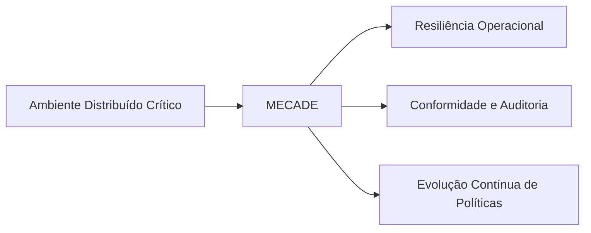
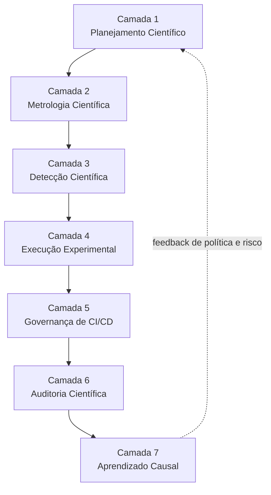
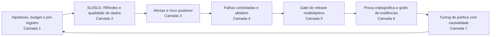
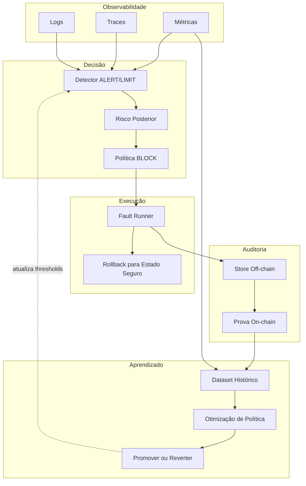
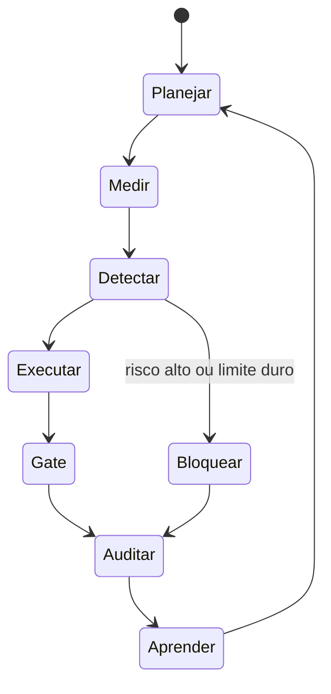
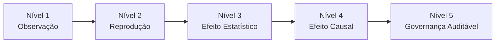

1111111111111111

# Overview do Framework MECADE

Este documento apresenta uma visão integrada do framework MECADE, conectando as 7 camadas em um fluxo único, com diagramas em múltiplos níveis de abstração para facilitar o entendimento técnico, acadêmico e de banca examinadora.

## Sumário

- [1. Visão geral em uma frase](#1-visão-geral-em-uma-frase)
- [2. Mapa rápido das camadas](#2-mapa-rápido-das-camadas)
- [3. Diagrama de contexto (nível executivo)](#3-diagrama-de-contexto-nível-executivo)
- [4. Diagrama macro das 7 camadas (nível arquitetural)](#4-diagrama-macro-das-7-camadas-nível-arquitetural)
- [5. Fluxo ponta a ponta de artefatos (nível operacional)](#5-fluxo-ponta-a-ponta-de-artefatos-nível-operacional)
- [6. Fluxo de dados e controle (nível engenharia)](#6-fluxo-de-dados-e-controle-nível-engenharia)
- [7. Sequência temporal de uma campanha (nível processo)](#7-sequência-temporal-de-uma-campanha-nível-processo)
- [8. Máquina de estados do ciclo de decisão](#8-máquina-de-estados-do-ciclo-de-decisão)
- [9. Árvore de decisão para release](#9-árvore-de-decisão-para-release)
- [10. Níveis de evidência](#10-níveis-de-evidência)
- [11. Integração entre camadas](#11-integração-entre-camadas)
- [12. Diferencial do modelo proposto](#12-diferencial-do-modelo-proposto)
- [13. Checklist de apresentação](#13-checklist-de-apresentação)

---

## 1. Visão geral em uma frase

O MECADE é um ciclo cibernético de dependabilidade que transforma:

> planejamento científico → medição robusta → detecção inteligente → execução controlada → governança de release → auditoria verificável → aprendizado causal contínuo

## 2. Mapa rápido das camadas

| Camada | Nome | Pergunta central | Saída principal |
|---|---|---|---|
| 1 | Planejamento Científico | O que testar e com qual rigor? | Hipóteses causais e *chaos budget* por risco |
| 2 | Metrologia Científica | Como medir com validade e incerteza? | SLI/SLO formal, RRIndex e regras de decisão |
| 3 | Detecção Científica | Quando agir e com qual evidência? | ALERT/LIMIT/BLOCK com risco posterior |
| 4 | Execução Experimental | Como injetar falha com segurança e causalidade? | Campanhas progressivas, *ablation* e estimativa de efeito |
| 5 | Governança de CI/CD | Quando promover release com evidência? | *Release gate* multiobjetivo e auditável |
| 6 | Auditoria Científica | Como provar integridade e proveniência? | Prova criptográfica off-chain/on-chain |
| 7 | Aprendizado Causal | Como evoluir política sem regressão? | *Upgrade*/*rollback* de política com efeito causal |

## 3. Diagrama de contexto (nível executivo)

## 4. Diagrama macro das 7 camadas (nível arquitetural)

## 5. Fluxo ponta a ponta de artefatos (nível operacional)

## 6. Fluxo de dados e controle (nível engenharia)

## 7. Sequência temporal de uma campanha (nível processo)

## 8. Máquina de estados do ciclo de decisão

## 9. Árvore de decisão para release

## 10. Níveis de evidência

| Nível | Designação | Critério de aceitação |
|---|---|---|
| 1 | Observação | Fenômeno registrado em pelo menos uma execução |
| 2 | Reprodução | Fenômeno reproduzido em execuções independentes |
| 3 | Efeito estatístico | Diferença significativa frente a um grupo de controle |
| 4 | Efeito causal | Efeito estimado por inferência causal (ex.: *ablation*, *uplift*) |
| 5 | Governança auditável | Decisão registrada em prova criptográfica off-chain/on-chain |

## 11. Integração entre camadas

| Etapa | Camada | Responsabilidade |
|---|---|---|
| 1 | Camada 1 | Define o contrato científico do experimento (hipóteses, FMEA, *chaos budget*) |
| 2 | Camada 2 | Transforma o contrato em medição válida (SLI/SLO, RRIndex) |
| 3 | Camada 3 | Converte medição em decisão em tempo real (ALERT/LIMIT/BLOCK) |
| 4 | Camada 4 | Executa falha controlada para gerar evidência (campanhas, *ablation*) |
| 5 | Camada 5 | Decide a promoção de release por *gate* multiobjetivo |
| 6 | Camada 6 | Ancora e prova a integridade de toda decisão |
| 7 | Camada 7 | Aprende causalmente e atualiza a política, retroalimentando a Camada 1 |

## 12. Diferencial do modelo proposto

O diferencial do framework não é uma ferramenta isolada, mas a integração formal entre:

| Eixo | Contribuição |
|---|---|
| Controle determinístico de segurança | Limita o *blast radius* por meio de limiares explícitos (`ALERT`/`LIMIT`/`BLOCK`) |
| Inferência estatística e causal | Garante que efeitos observados sejam atribuíveis, não apenas correlacionados |
| Experimentação reprodutível | Protocolos pré-registrados e campanhas comparáveis entre execuções |
| Governança criptograficamente verificável | Prova de integridade e proveniência de cada decisão tomada |

Essa integração permite sustentar, em banca, que o modelo evolui de uma prova de conceito (PoC) para um sistema de engenharia científica de dependabilidade.

## 13. Checklist de apresentação

Roteiro recomendado para apresentar a implementação, os testes e a validação de cada camada:

1. Apresentar o diagrama macro das 7 camadas (Seção 4).
2. Apresentar um fluxo ponta a ponta de artefatos (Seção 5).
3. Apresentar a sequência temporal de uma campanha real (Seção 7).
4. Apresentar a árvore de decisão de release (Seção 9).
5. Apresentar o nível de evidência alcançado, de 1 a 5 (Seção 10).
