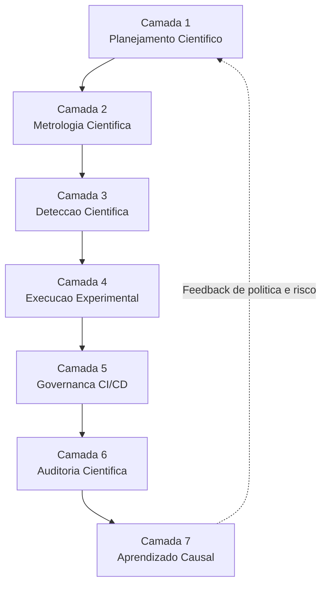
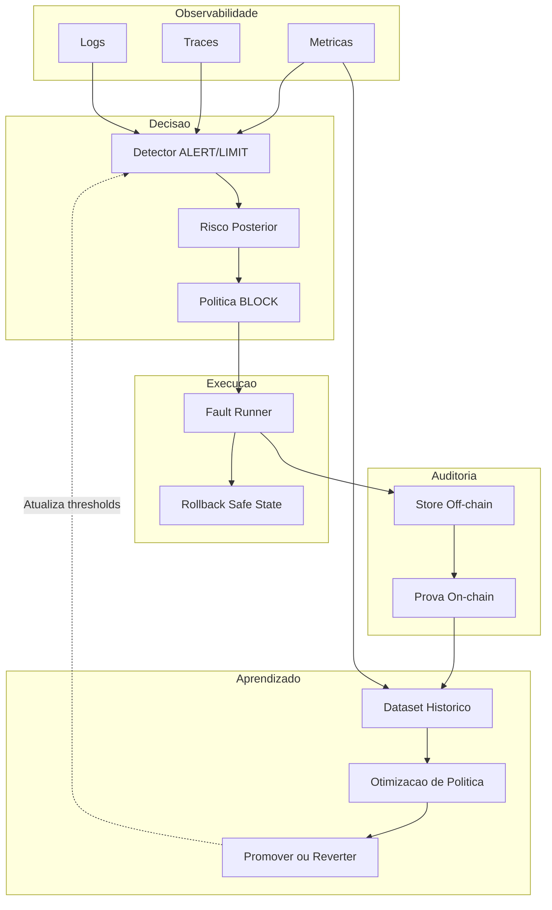
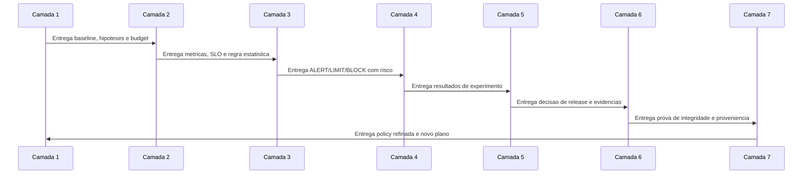
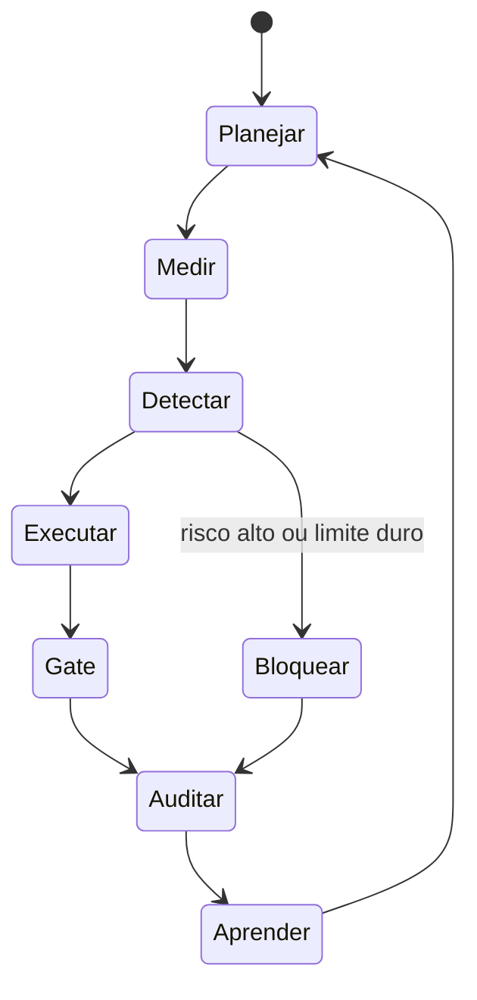
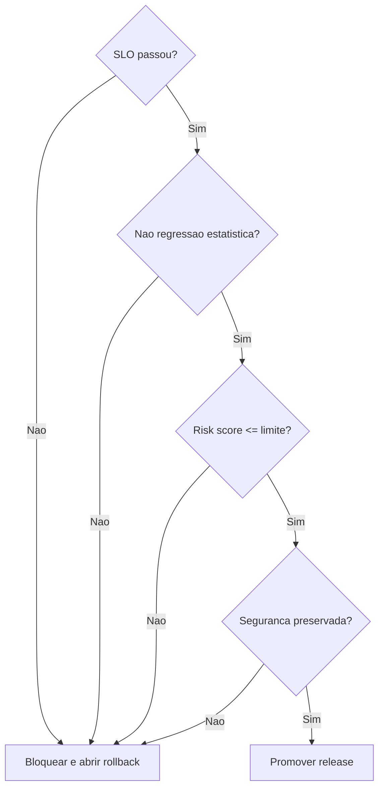
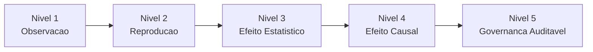

# OVERVIEW DO FRAMEWORK MECADE (MEDADE)

Este documento apresenta uma visao integrada do framework proposto, conectando as 7 camadas em um fluxo unico, com diagramas em varios niveis para facilitar entendimento tecnico, academico e de banca.

## 1. Visao geral em uma frase

O MECADE e um ciclo cibernetico de dependabilidade que transforma: planejamento cientifico -> medicao robusta -> deteccao inteligente -> execucao controlada -> governanca de release -> auditoria verificavel -> aprendizado causal continuo.

## 2. Mapa rapido das camadas

| Camada | Nome | Pergunta central | Saida principal |
|---|---|---|---|
| 1 | Planejamento Cientifico | O que testar e com qual rigor? | Hipoteses causais + Chaos Budget por risco |
| 2 | Metrologia Cientifica | Como medir com validade e incerteza? | SLI/SLO formal + RRIndex + regras de decisao |
| 3 | Deteccao Cientifica | Quando agir e com qual evidencia? | ALERT/LIMIT/BLOCK com risco posterior |
| 4 | Execucao Experimental | Como injetar falha com seguranca e causalidade? | Campanhas progressivas + ablation + efeito |
| 5 | Governanca de CI/CD | Quando promover release com evidencia? | Release gate multiobjetivo e auditavel |
| 6 | Auditoria Cientifica | Como provar integridade e proveniencia? | Prova criptografica off-chain/on-chain |
| 7 | Aprendizado Causal | Como evoluir politica sem regressao? | Upgrade/rollback de politica com efeito causal |

## 3. Diagrama de contexto (nivel executivo)

## 4. Diagrama macro das 7 camadas (nivel arquitetural)

## 5. Fluxo ponta a ponta de artefatos (nivel operacional)

## 6. Fluxo de dados e controle (nivel engenharia)

## 7. Sequencia temporal de uma campanha (nivel processo)

## 8. Maquina de estados do ciclo de decisao

## 9. Arvore de decisao para release

## 10. Diagrama de niveis de evidencia

## 11. Como as camadas se interligam na pratica

1. A Camada 1 define o contrato cientifico do experimento.
2. A Camada 2 transforma contrato em medicao valida.
3. A Camada 3 converte medicao em decisao em tempo real.
4. A Camada 4 executa falha controlada para gerar evidencia.
5. A Camada 5 decide promocao de release por gate multiobjetivo.
6. A Camada 6 ancora e prova integridade de toda decisao.
7. A Camada 7 aprende causalmente e atualiza politica.

## 12. Diferencial do modelo proposto

O diferencial do framework nao e ferramenta isolada. E a integracao formal entre:

- controle deterministico de seguranca,
- inferencia estatistica e causal,
- experimentacao reproduzivel,
- e governanca criptograficamente verificavel.

Isso permite defender em banca que o modelo evolui de PoC para um sistema de engenharia cientifica de dependabilidade.

## 13. Checklist

Roteiro de implementacao, teste e validacao de cada camada:

1. Mostrar o diagrama macro das 7 camadas.
2. Mostrar um fluxo ponta a ponta de artefatos.
3. Mostrar a sequencia temporal de uma campanha real.
4. Mostrar a arvore de decisao de release.
5. Mostrar o nivel de evidencia alcancado (1 a 5).
