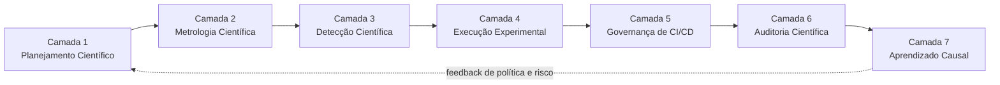
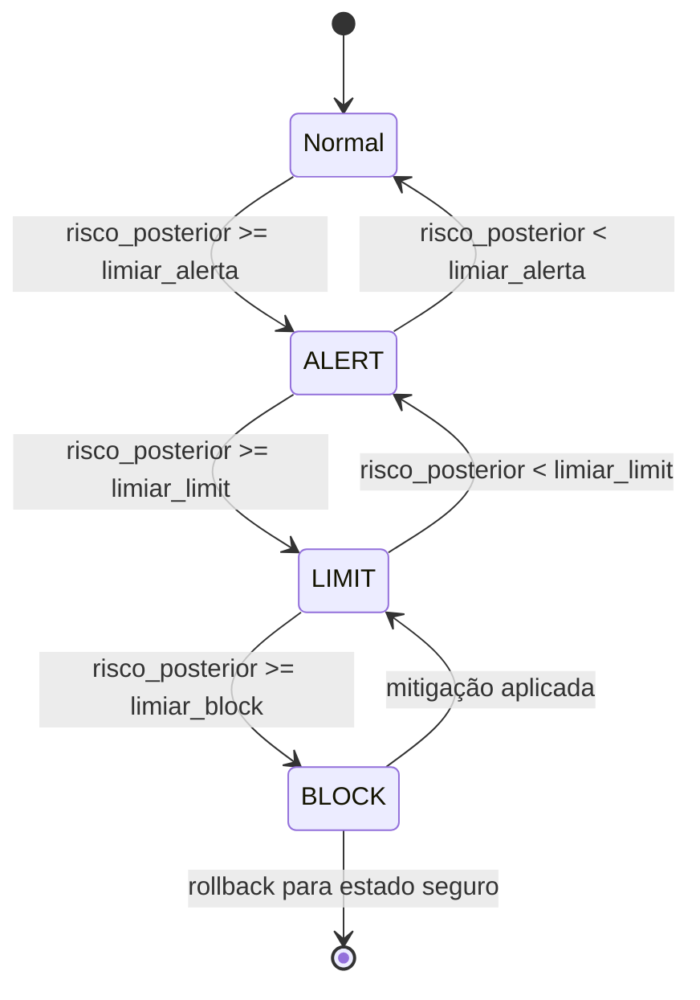

<div align="center">

# MECADE

**Modelo de Engenharia do Caos para Avaliação da Garantia de Dependabilidade em Sistemas Críticos Distribuídos**

[](#evidências-e-escopo-científico)
[](#mapeamento-de-guias-e-implementação-validação-e2e-camadas-01-a-07)
[](#visão-geral)
[](#)

</div>

---

## Sumário

- [Visão geral](#visão-geral)
- [Problema que o MECADE endereça](#problema-que-o-mecade-endereça)
- [Modelo de referência](#modelo-de-referência)
  - [Ciclo das 7 camadas](#ciclo-das-7-camadas)
  - [Governança axiomática (ALERT, LIMIT, BLOCK)](#governança-axiomática-alert-limit-block)
- [Diferenciais técnicos](#diferenciais-técnicos)
- [Evidências e escopo científico](#evidências-e-escopo-científico)
- [Quickstart](#quickstart)
- [Estrutura deste repositório](#estrutura-deste-repositório)
  - [Mapeamento de guias e implementação/validação E2E (Camadas 01 a 07)](#mapeamento-de-guias-e-implementação-validação-e2e-camadas-01-a-07)
  - [Mapeamento de campanha experimental (Seção VIII-C)](#mapeamento-de-campanha-experimental-seção-viii-c)
  - [Arquivos principais de navegação](#arquivos-principais-de-navegação)
- [Objetivo prático](#objetivo-prático)
- [Como citar](#como-citar)

---

## Visão geral

O **MECADE** é um framework de engenharia do caos orientado a *dependabilidade*, projetado para ambientes distribuídos de alta criticidade — financeiro, aeroespacial, energia e infraestrutura essencial.

A proposta central é transformar a experimentação de falhas de uma prática *ad hoc* em um ciclo cibernético estruturado, com:

| Pilar | Descrição |
|---|---|
| Controle de risco | Determinístico, calculado a partir de um *chaos budget* por nível de criticidade |
| Validação empírica | Resiliência avaliada sob estresse controlado, com causalidade explícita |
| Auditoria | Trilha verificável (off-chain/on-chain) para conformidade e forense |

## Problema que o MECADE endereça

Abordagens tradicionais costumam tratar, de forma separada:

- observabilidade
- execução de caos
- governança e auditoria

Em sistemas críticos, essa fragmentação dificulta:

| Limitação | Consequência |
|---|---|
| Ausência de integração entre medição e execução | MTTR e RTO não são reduzidos de forma previsível |
| Detecção tardia ou reativa | Falhas cinzentas (*gray failures*) não são identificadas com antecedência |
| Auditoria desacoplada da execução | Rastreabilidade de decisões e recuperações não é imutável |

### Arquivos principais de navegação

| Arquivo | Descrição |
|---|---|
| [OVERVIEW_FRAMEWORK_MECADE.md](OVERVIEW_FRAMEWORK_MECADE.md) | Visão integrada do framework e conexão entre as 7 camadas |
| [MECADE_CAMPANHA_MINIMA_VIAVEL_VIII_C_A1.md](MECADE_CAMPANHA_MINIMA_VIAVEL_VIII_C_A1.md) | Protocolo mínimo para campanha A/B pareada em Kubernetes (tier A1) |
| [MECADE_CAMPANHA_MINIMA_VIAVEL_VIII_C_A1/README.md](MECADE_CAMPANHA_MINIMA_VIAVEL_VIII_C_A1/README.md) | Implementação executável da campanha mínima viável (scripts, validação e evidências) |

## Modelo de referência

O MECADE organiza a operação em **7 camadas funcionais**, formando um loop fechado de melhoria contínua.

| Camada | Nome | Pergunta central | Saída principal |
|---|---|---|---|
| 1 | Planejamento Científico | O que testar e com qual rigor? | Hipóteses causais e *chaos budget* por risco |
| 2 | Metrologia Científica | Como medir com validade e incerteza? | SLI/SLO formal, RRIndex e regras de decisão |
| 3 | Detecção Científica | Quando agir e com qual evidência? | ALERT/LIMIT/BLOCK com risco posterior |
| 4 | Execução Experimental | Como injetar falha com segurança e causalidade? | Campanhas progressivas, *ablation* e estimativa de efeito |
| 5 | Governança de CI/CD | Quando promover release com evidência? | *Release gate* multiobjetivo e auditável |
| 6 | Auditoria Científica | Como provar integridade e proveniência? | Prova criptográfica off-chain/on-chain |
| 7 | Aprendizado Causal | Como evoluir política sem regressão? | *Upgrade*/*rollback* de política com efeito causal |

### Ciclo das 7 camadas



> Para diagramas adicionais (contexto, arquitetura macro, fluxo de artefatos e fluxo de dados/controle), consulte o [OVERVIEW_FRAMEWORK_MECADE.md](OVERVIEW_FRAMEWORK_MECADE.md).

### Governança axiomática (ALERT, LIMIT, BLOCK)

A Camada 3 implementa uma máquina de estados determinística que classifica o risco posterior em três faixas de decisão.



| Estado | Gatilho | Ação automática |
|---|---|---|
| `ALERT` | Risco posterior acima do limiar de atenção | Notificação e aumento de granularidade de coleta |
| `LIMIT` | Risco posterior acima do limiar de contenção | Redução do *blast radius* e *throttling* de novos experimentos |
| `BLOCK` | Risco posterior acima do limiar crítico | Interrupção do experimento e *rollback* para estado seguro |

## Diferenciais técnicos

| Diferencial | Descrição |
|---|---|
| Governança axiomática | Decisões automáticas baseadas em `ALERT`, `LIMIT` e `BLOCK` com limiares explícitos |
| *Safety Envelope* formal | Contenção determinística do *blast radius* durante experimentos |
| Integração nativa com observabilidade | Métricas, traces e logs alimentam diretamente o detector de risco |
| Arquitetura de auditoria | Proveniência e integridade verificáveis off-chain/on-chain |
| Evolução contínua | Ajuste de políticas orientado por efeito causal mensurado |

## Evidências e escopo científico

> No estado atual, o MECADE apresenta prova de conceito em ambiente controlado. Os resultados devem ser interpretados como **evidências preliminares**, com consolidação prevista via campanhas adicionais em ambientes representativos.

## Quickstart

A campanha mínima viável (Tier A1) demonstra o ciclo completo end-to-end em um cluster Kubernetes local, usando o Online Boutique como sistema sob teste.

```bash
git clone https://github.com/richardsonlima/mecade.git
cd mecade/MECADE_CAMPANHA_MINIMA_VIAVEL_VIII_C_A1

# instalação de dependências e bootstrap do ambiente
bash scripts/install.sh

# execução do fluxo E2E completo (planejamento -> execução -> auditoria)
bash scripts/run-e2e.sh
```

Fluxo completo em cluster Kubernetes, incluindo bootstrap da aplicação de referência e validação dos artefatos gerados:

```bash
bash scripts/bootstrap-online-boutique.sh
bash scripts/docker-up.sh
bash scripts/run-e2e.sh
bash scripts/validate.sh
bash scripts/docker-down.sh
```

Endpoints expostos localmente via Docker Compose:

| Serviço | URL |
|---|---|
| Online Boutique (Frontend) | `http://localhost:8088` |
| Prometheus | `http://localhost:9790` |
| Grafana (admin/admin) | `http://localhost:3700` |
| OpenTelemetry Collector | `http://localhost:9788` |
| Jupyter Lab (token `mecade`) | `http://localhost:9498/lab?token=mecade` |

Detalhes completos em [MECADE_CAMPANHA_MINIMA_VIAVEL_VIII_C_A1/README.md](MECADE_CAMPANHA_MINIMA_VIAVEL_VIII_C_A1/README.md).

## Estrutura deste repositório

### Mapeamento de guias e implementação/validação E2E (Camadas 01 a 07)

| Camada | Guia (MD) | Pasta de implementação/validação E2E | Status atual |
|---|---|---|---|
| 01 | [MECADE_IMPLEMENTACAO_CAMADA01.md](MECADE_IMPLEMENTACAO_CAMADA01.md) | [MECADE_IMPLEMENTACAO_CAMADA01](MECADE_IMPLEMENTACAO_CAMADA01) | Implementada e validada E2E |
| 02 | [MECADE_IMPLEMENTACAO_CAMADA02.md](MECADE_IMPLEMENTACAO_CAMADA02.md) | [MECADE_IMPLEMENTACAO_CAMADA02](MECADE_IMPLEMENTACAO_CAMADA02) | Implementada e validada E2E |
| 03 | [MECADE_IMPLEMENTACAO_CAMADA03.md](MECADE_IMPLEMENTACAO_CAMADA03.md) | [MECADE_IMPLEMENTACAO_CAMADA03](MECADE_IMPLEMENTACAO_CAMADA03) | Implementada e validada E2E |
| 04 | [MECADE_IMPLEMENTACAO_CAMADA04.md](MECADE_IMPLEMENTACAO_CAMADA04.md) | [MECADE_IMPLEMENTACAO_CAMADA04](MECADE_IMPLEMENTACAO_CAMADA04) | Implementada e validada E2E |
| 05 | [MECADE_IMPLEMENTACAO_CAMADA05.md](MECADE_IMPLEMENTACAO_CAMADA05.md) | [MECADE_IMPLEMENTACAO_CAMADA05](MECADE_IMPLEMENTACAO_CAMADA05) | Implementada e validada E2E |
| 06 | [MECADE_IMPLEMENTACAO_CAMADA06.md](MECADE_IMPLEMENTACAO_CAMADA06.md) | [MECADE_IMPLEMENTACAO_CAMADA06](MECADE_IMPLEMENTACAO_CAMADA06) | Implementada e validada E2E |
| 07 | [MECADE_IMPLEMENTACAO_CAMADA07.md](MECADE_IMPLEMENTACAO_CAMADA07.md) | [MECADE_IMPLEMENTACAO_CAMADA07](MECADE_IMPLEMENTACAO_CAMADA07) | Implementada e validada E2E |

### Mapeamento de campanha experimental (Seção VIII-C)

| Campanha | Guia (MD) | Pasta de implementação/validação | Status atual |
|---|---|---|---|
| Campanha mínima viável Tier A1 | [MECADE_CAMPANHA_MINIMA_VIAVEL_VIII_C_A1.md](MECADE_CAMPANHA_MINIMA_VIAVEL_VIII_C_A1.md) | [MECADE_CAMPANHA_MINIMA_VIAVEL_VIII_C_A1](MECADE_CAMPANHA_MINIMA_VIAVEL_VIII_C_A1) | Implementação executável criada |

## Objetivo prático

Permitir que equipes de engenharia validem resiliência de forma reproduzível, auditável e governada por risco, sem sacrificar requisitos de operação de sistemas críticos distribuídos.

## Como citar

```bibtex
@software{mecade,
  author       = {LIMA, Richardson Edson de},
  title        = {MECADE: A Chaos Engineering Model for Dependability Assurance Evaluation in Distributed Critical Systems},
  year         = {2026},
  publisher    = {GitHub},
  url          = {https://github.com/richardsonlima/mecade}
}
```
